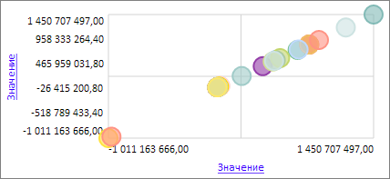
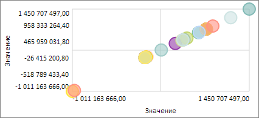

# EaxBubbleChartView.EnableHyperlinkText

EaxBubbleChartView.EnableHyperlinkText
-

**

# EaxBubbleChartView.EnableHyperlinkText

## Синтаксис

EnableHyperlinkText: Boolean

## Описание

Свойство EnableHyperlinkText** определяет, разрешены ли гиперссылки в текстовых надписях пузырьковой диаграммы экспресс-отчета.

## Комментарии

Значение свойство можно установить с помощью метода setEnableHyperlinkText и из JSON, возвратить - с помощью метода getEnableHyperlinkText.

Свойство содержит значение true, если в текстовых надписях пузырьковой диаграммы разрешены гиперссылки , и false - в противном случае. По умолчанию имеет значение true.

## Пример

Для выполнения примера необходимо наличие на html-странице компонента [ExpressBox](../../../Components/Express/ExpressBox/ExpressBox.htm) с наименованием «expressBox» (см. «[Пример создания компонента ExpressBox](../../../Components/Express/ExpressBox/ExpressBox_Example.htm)») и с загруженной пузырьковой диаграммой в рабочей области экспресс-отчета. Запретим гиперссылки в текстовых надписях данной пузырьковой диаграммы:

// Получаем мастер управления пузырьковой диаграммой экспресс-отчета
var master = expressBox.getPropertyBarView().getBubbleChartMaster();
// Получаем представление пузырьковой диаграммы экспресс-отчета
var bubbleChartView = master.getDataView();
// Запрещаем гиперссылки
bubbleChartView.setEnableHyperlinkText(false);
// Обновляем представление пузырьковой диаграммы
bubbleChartView.refreshAll();

До выполнения примера гиперссылки в надписях пузырьковой диаграммы экспресс-отчета присутствуют:

После выполнения примера гиперссылки в надписях пузырьковой диаграммы экспресс-отчета будут отсутствовать:

См. также:

[EaxBubbleChartView](EaxBubbleChartView.htm)

		Справочная
		 система на версию 10.9
		 от 18/08/2025,
		 © ООО «ФОРСАЙТ»,
