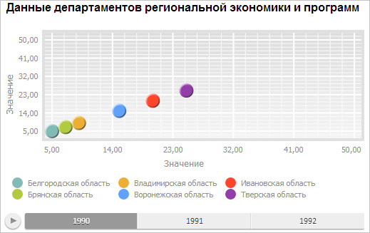

# EaxBubbleChartView.LegendPosition

EaxBubbleChartView.LegendPosition
-

# EaxBubbleChartView.LegendPosition

## Синтаксис

LegendPosition: String;

## Описание

Свойство LegendPosition определяет расположение легенды пузырьковой диаграммы.

## Комментарии

Значение свойства устанавливается с помощью метода setLegendPosition, а возвращается с помощью метода getLegendPosition. Из JSON значение задать нельзя.

Свойство может содержать следующие строковые значения: «bottom» или «top» - расположение легенды снизу или сверху от области построения пузырьковой диаграммы, «left» или «right» - выравнивание по левому или правому краю. Данные значения могут комбинироваться с использованием разделителя «|».

## Пример

Для выполнения примера необходимо наличие на html-странице компонента [ExpressBox](../../../Components/Express/ExpressBox/ExpressBox.htm) с наименованием «expressBox» (см. «[Пример создания компонента ExpressBox](../../../Components/Express/ExpressBox/ExpressBox_Example.htm)») и с загруженной пузырьковой диаграммой в области данных. Расположим легенду под областью построения пузырьковой диаграммы слева:

// Получим контейнер с пузырьковой диаграммой экспресс-отчёта
var bubbleChart = expressBox.getDataView().getBubbleChartView();
// Расположим легенду под областью построения пузырьковой диаграммы слева
bubbleChart.setLegendPosition("bottom|left");

В результате выполнения примера легенда была отображена под областью построения пузырьковой диаграммы слева:

См. также:

[EaxBubbleChartView](EaxBubbleChartView.htm)

		Справочная
		 система на версию 10.9
		 от 18/08/2025,
		 © ООО «ФОРСАЙТ»,
