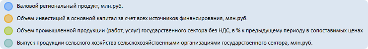

# EaxBubbleChartView.addBubbleSettings

EaxBubbleChartView.addBubbleSettings
-

**

# EaxBubbleChartView.addBubbleSettings

## Синтаксис

addBubbleSettings(settings);

## Параметры

*settings.* Настройки пузырьковой диаграммы
 экспресс-отчета в виде строки JSON.

## Описание

Метод addBubbleSettings**
 добавляет настройки пузырьковой диаграммы экспресс-отчета.

## Пример

Для выполнения примера необходимо наличие на html-странице компонента
 [ExpressBox](../../../Components/Express/ExpressBox/ExpressBox.htm)
 с наименованием «expressBox» (см. «[Пример
 создания компонента ExpressBox](../../../Components/Express/ExpressBox/ExpressBox_Example.htm)») и с загруженной пузырьковой диаграммой в области
 данных. Далее зададим для легенды пузырьковой диаграммы экспресс-отчета новый цвет заливки
 и прозрачность:

// Получаем список панелей у мастера управления пузырьковой диаграммой экспресс-отчета
var master = expressBox.getPropertyBarView().getBubbleChartMaster();
var bubbleChartView = master.getDataView();
// Получаем текущие цвет заливки и прозрачность легенды пузырьковой диаграммы экспресс-отчета
var solid = bubbleChartView.getOptions().BubbleChart.Legend.ChartLegend.Background.SolidColorBrush;
console.log("Цвет заливки и празрачность легенды пузырьковой диаграммы: " + JSON.stringify(solid));
// Устанавливаем новые значения цвета заливки и прозрачности пузырьковой диаграммы
var options = "[{\"Name\":\"chartmaster.legendpanel.background\",\"Value\":{\"SolidColorBrush\":{\"@Color\":\"#DCE6F1\",\"@Opacity\":50}}}]";
bubbleChartView.addBubbleSettings(options);

В результате выполнения примера в консоли браузера были выведены текущие
 значения цвета заливки и прозрачности для легенды пузырьковой диаграммы,а также установлены
 их новые значения:

Цвет заливки и прозрачность легенды пузырьковой диаграммы:

{"@Color":"#00FFFFFF","@Opacity":"1"}

Сама пузырьковая диаграмма экспресс-отчета примет следующий вид:

[EaxBubbleChartView](EaxBubbleChartView.htm)

		Справочная
		 система на версию 10.9
		 от 18/08/2025,
		 © ООО «ФОРСАЙТ»,
