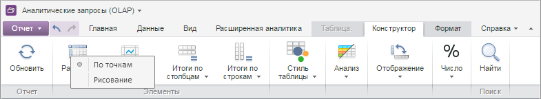

# EaxCategoryView.getChartEditingMenu

EaxCategoryView.getChartEditingMenu
-

# EaxCategoryView.getChartEditingMenu

## Синтаксис

getChartEditingMenu(btnId: String);

## Параметры

btnId. Идентификатор кнопки.

## Описание

Метод getChartEditingMenu возвращает
 меню редактирования графика панели инструментов экспресс-отчета.

## Пример

Для выполнения примера необходимо наличие на html-странице компонента
 [ExpressBox](../ExpressBox/ExpressBox.htm) с наименованием
 «expressBox» (см. [Пример
 создания компонента ExpressBox](../../../Components/Express/ExpressBox/ExpressBox_Example.htm)). Вызываем меню редактирования графика
 панели инструментов экспресс-отчета:

// Получаем представление вкладки «Таблица»
var category = expressBox.getRibbonView().getTableCategory();
// Получаем объект с настройками
var menu = category.getChartEditingMenu();
// Отображаем меню
menu.showContext(100, 80);
В результате будет отображено меню редактирования графика:

См.
 также:

[EaxCategoryView](EaxCategoryView.htm)

		Справочная
		 система на версию 10.9
		 от 18/08/2025,
		 © ООО «ФОРСАЙТ»,
