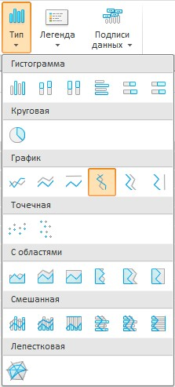

# EaxCategoryView.getChartTypeMenu

EaxCategoryView.getChartTypeMenu
-

**

# EaxCategoryView.getChartTypeMenu

## Синтаксис

getChartTypeMenu();

## Описание

Метод getChartTypeMenu** возвращает меню «Тип», с помощью которого задается тип отображения диаграммы.

## Комментарии

Метод возвращает объект типа PP.Ui.Menu. На ленте инструментов данное меню выглядит следующим образом:

## Пример

Для выполнения примера необходимо наличие на html-странице компонента [ExpressBox](../ExpressBox/ExpressBox.htm) с наименованием «expressBox» (см. [Пример создания компонента ExpressBox](../../../Components/Express/ExpressBox/ExpressBox_Example.htm)). В приведенном ниже примере выводятся наименования элементов для различных меню на ленте инструментов:

// Функция для вывода наименования элементов меню
getItemsValue = function(items, number) {
    var str = number + ". ";
    for(var i = 0; i < items.length; i++) {
        var item = items[i];
        str += item.getContent();
        str += "; ";
    }
    console.log(str);
}
var category = expressBox.getRibbonView().getChartCategory();
getItemsValue(category.getChartTypeMenu().getItems(), 1);
getItemsValue(category.getDataTypeMenu().getItems(), 2);
getItemsValue(category.getFilterMenu().getItems(), 3);
getItemsValue(category.getGrowthIndicatorMenu().getItems(), 4);
getItemsValue(category.getRankingMenu().getItems(), 5);
getItemsValue(category.getTableAreaChartMenu().getItems(), 6);
getItemsValue(category.getTableCFormatButtonMenu().getItems(), 7);
getItemsValue(category.getTitleMenu().getItems(), 8);
getItemsValue(category.getTotalsInColumnsMenu().getItems(), 9);
getItemsValue(category.getTotalsInRowsMenu().getItems(), 10);

В результате выполнения данного примера в консоли браузера будет выведен следующий текст:

1. Гистограмма; [object Object]; Круговая; [object Object]; График; [object Object]; С областями; [object Object]; Смешанная; [object Object];

2. Рост, %; Прирост, %; Изменение; Доля, %;

3. Скрыть пустые ячейки; Скрыть ячейки с нулевыми значениями; Скрыть ячейки с нечисловыми значениями;

4. Для строк; Для столбцов;

5. По убыванию по строкам; По возрастанию по строкам; По убыванию по столбцам; По возрастанию по столбцам; По убыванию по всей таблице; По возрастанию по всей таблице;

6. Вся таблица; Выделенная область;

7. [object Object]; null; Удалить;

8. Простой; Элемент управления;

9. Сумма; Среднее; Минимум; Максимум; Количество непустых; Количество пустых; Мода; Медиана; Дисперсия; Среднеквадратическое отклонение; Ассиметрия; Эксцесс; Размах; Коэффициент вариации; Сумма квадратов; Автокорреляция 1-го порядка; Верхняя дециль; Верхняя квартиль; Нижняя квартиль; Нижняя дециль; Общий итог;

10. Сумма; Среднее; Минимум; Максимум; Количество непустых; Количество пустых; Мода; Медиана; Дисперсия; Среднеквадратическое отклонение; Ассиметрия; Эксцесс; Размах; Коэффициент вариации; Сумма квадратов; Автокорреляция 1-го порядка; Верхняя дециль; Верхняя квартиль; Нижняя квартиль; Нижняя дециль; Общий итог;

См. также:

[EaxCategoryView](EaxCategoryView.htm)

		Справочная
		 система на версию 10.9
		 от 18/08/2025,
		 © ООО «ФОРСАЙТ»,
