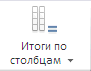

# EaxCategoryView.getColTotalsButton

EaxCategoryView.getColTotalsButton
-

**

# EaxCategoryView.getColTotalsButton

## Синтаксис

getColTotalsButton();

## Описание

Метод getColTotalsButton** возвращает кнопку «Итоги по столбцам» на ленте инструментов экспресс-отчета.

## Комментарии

Метод возвращает объект типа PP.Ui.SplitButton. На ленте инструментов данная кнопка выглядит следующим образом:

## Пример

Для выполнения примера необходимо наличие на html-странице компонента [ExpressBox](../ExpressBox/ExpressBox.htm) с наименованием «expressBox» (см. [Пример создания компонента ExpressBox](../../../Components/Express/ExpressBox/ExpressBox_Example.htm)). В приведенном ниже примере выводятся наименования кнопок, а также индекс строки и столбца в таблице пиктограмм:

var category;
getImageInfo = function(button) {
    // Выводим название кнопки
    var str = button.getContent() + ". ";
    if (button instanceof PP.Ui.SplitButton) {
        str += "Row index: "
        // Выводим индекс строки в таблице пиктограмм
        str += button.getImageButton().getRowIndex();
        str += ", Column index: "
        // Выводим индекс столбца в таблице пиктограмм
        str += button.getImageButton().getColumnIndex();
    }
    console.log(str);
}
// Получим представление вкладки «Таблица»
category = expressBox.getRibbonView().getTableCategory();
getImageInfo(category.getColTotalsButton());
getImageInfo(category.getCondFormatButton());
getImageInfo(category.getIndButton());
getImageInfo(category.getRowsTotalsButton());
// Получим представление вкладки «Данные»
category = expressBox.getRibbonView().getDataRibbonCategory();
getImageInfo(category.getFilterButton());
getImageInfo(category.getRankingButton());
getImageInfo(category.getTypeDataButton());
// Получим представление вкладки «Заголовок»
category = expressBox.getRibbonView().getTitleCategory();
getImageInfo(category.getTitleButton());
// Получим представление вкладки «Вид»
category = expressBox.getRibbonView().getViewRibbonCategory();
getImageInfo(category.getDimViewModeButton());

В результате выполнения данного примера в консоли браузера будет выведен следующий текст:

Итоги по столбцам. Row index: 5, Column index: 5

Условное форматирование. Row index: 3, Column index: 4

Индикатор роста. Row index: 2, Column index: 19

Итоги по строкам. Row index: 5, Column index: 4

Фильтр. Row index: 3, Column index: 1

Отобразить как ранги. Row index: 2, Column index: 18

Преобразовать данные. Row index: 1, Column index: 18

Заголовок. Row index: 3, Column index: 20

Боковая панель.

См. также:

[EaxCategoryView](EaxCategoryView.htm)

		Справочная
		 система на версию 10.9
		 от 18/08/2025,
		 © ООО «ФОРСАЙТ»,
