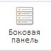

# EaxCategoryView.getDimViewModeButton

EaxCategoryView.getDimViewModeButton
-

**

# EaxCategoryView.getDimViewModeButton

## Синтаксис

getDimViewModeButton();

## Описание

Метод getDimViewModeButton** возвращает кнопку «Боковая панель» на ленте инструментов экспресс-отчета.

## Комментарии

Метод возвращает объект типа PP.Ui.RibbonButton. На ленте инструментов данная кнопка выглядит следующим образом:

## Пример

Пример использования метода приведен на странице описания метода [EaxCategoryView.getColTotalsButton](EaxCategoryView.getColTotalsButton.htm).

См. также:

[EaxCategoryView](EaxCategoryView.htm)

		Справочная
		 система на версию 10.9
		 от 18/08/2025,
		 © ООО «ФОРСАЙТ»,
