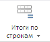

# EaxCategoryView.getRowsTotalsButton

EaxCategoryView.getRowsTotalsButton
-

**

# EaxCategoryView.getRowsTotalsButton

## Синтаксис

getRowsTotalsButton();

## Описание

Метод getRowsTotalsButton** возвращает кнопку «Итоги по строкам» на ленте инструментов экспресс-отчета.

## Комментарии

Метод возвращает объект типа PP.Ui.SplitButton. На ленте инструментов данная кнопка выглядит следующим образом:

## Пример

Пример использования метода приведен на странице описания метода [EaxCategoryView.getColTotalsButton](EaxCategoryView.getColTotalsButton.htm).

См. также:

[EaxCategoryView](EaxCategoryView.htm)

		Справочная
		 система на версию 10.9
		 от 18/08/2025,
		 © ООО «ФОРСАЙТ»,
