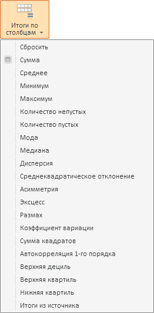

# EaxCategoryView.getTotalsInColumnsMenu

EaxCategoryView.getTotalsInColumnsMenu
-

**

# EaxCategoryView.getTotalsInColumnsMenu

## Синтаксис

getTotalsInColumnsMenu();

## Описание

Метод getTotalsInColumnsMenu**
 возвращает меню «Итоги по столбцам»
 ленты инструментов экспресс-отчета.

## Комментарии

Метод возвращает объект типа PP.Ui.Menu.
 На ленте инструментов данное меню выглядит следующим образом:

## Пример

Пример использования метода приведен на странице описания метода [EaxCategoryView.getChartTypeMenu](EaxCategoryView.getChartTypeMenu.htm).

См. также:

[EaxCategoryView](EaxCategoryView.htm)

		Справочная
		 система на версию 10.9
		 от 18/08/2025,
		 © ООО «ФОРСАЙТ»,
