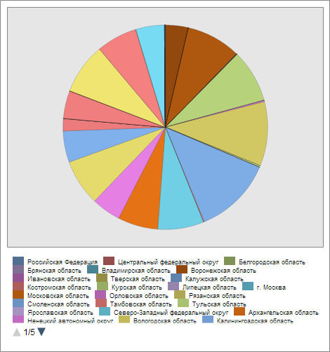

# EaxChartView.ChartType

EaxChartView.ChartType
-

**

# EaxChartView.ChartType

## Синтаксис

ChartType: Object|String

## Описание

Свойство ChartType** устанавливает и возвращает тип диаграммы экспресс-отчета.

## Комментарии

Значение свойства устанавливается с помощью метода setChartType и возвращается с помощью метода getChartType. Из JSON значение свойства установить нельзя.

Метод setChartType принимает в качестве параметра строку. Метод getChartType имеет параметр asString, при значении, равном true, которого будет возвращена строка, иначе - объект со следующими полями: Inverted - способ отображения диаграммы сверху вниз или слева направо, Stacking - способ накопления значений диаграммы, Type - тип диаграммы.

Для указания типа диаграммы экспресс-отчета используется строки «line», «column», «pie», «area», «scatter» с возможным указанием через символ «|» значений «Inverted», «StackedA», «StackedP».

## Пример

Для выполнения примера необходимо наличие на html-странице компонента [ExpressBox](../../../Components/Express/ExpressBox/ExpressBox.htm) с наименованием «expressBox» (см. «[Пример создания компонента ExpressBox](../../../Components/Express/ExpressBox/ExpressBox_Example.htm)») и с загруженной диаграммой в рабочей области экспресс-отчета. Преобразуем исходную гистограмму в круговую диаграмму:

// Получаем представление диаграммы экспресс-отчета
var chartView = expressBox.getDataView().getChartView();
// Изменим тип диаграммы
chartView.setChartType("pie");
// Обновляем диаграмму экспресс-отчета
chartView.refreshAll();

В результате выполнения примера исходная столбчатая диаграмма была преобразована в круговую:

См. также:

[EaxChartView](EaxChartView.htm)

		Справочная
		 система на версию 10.9
		 от 18/08/2025,
		 © ООО «ФОРСАЙТ»,
