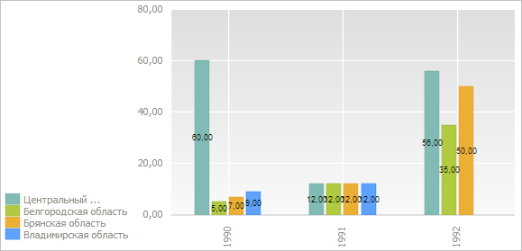

# EaxChartView.LegendPosition

EaxChartView.LegendPosition
-

# EaxChartView.LegendPosition

## Синтаксис

LegendPosition: String;

## Описание

Свойство LegendPosition определяет расположение легенды диаграммы.

## Комментарии

Значение свойства с помощью метода setLegendPosition, а возвращается с помощью метода getLegendPosition. Из JSON значение задать нельзя.

Свойство может содержать следующие строковые значения: «bottom» или «top» - расположение легенды снизу или сверху от области построения диаграммы, «left» или «right» - выравнивание по левому или правому краю. Данные значения могут комбинироваться с использованием разделителя «|».

## Пример

Для выполнения примера необходимо наличие на html-странице компонента [ExpressBox](../../../Components/Express/ExpressBox/ExpressBox.htm) с наименованием «expressBox» (см. «[Пример создания компонента ExpressBox](../../../Components/Express/ExpressBox/ExpressBox_Example.htm)») и с загруженной диаграммой в области данных. Расположим легенду под областью построения диаграммы слева и отобразим подписи для рядов данных:

// Получим контейнер с диаграммой экспресс-отчёта
var chartView = expressBox.getDataView().getChartView();
// Расположим легенду карты под областью построения диаграммы слева
chartView.setLegendPosition("bottom|left");
// Отобразим подписи рядов
chartView.setSignaturesOptions("%Autovalue", "custom", true);

В результате выполнения примера легенда была расположена под областью построения диаграммы слева, а также были отображены подписи для рядов данных:

См. также:

[EaxChartView](EaxChartView.htm)

		Справочная
		 система на версию 10.9
		 от 18/08/2025,
		 © ООО «ФОРСАЙТ»,
