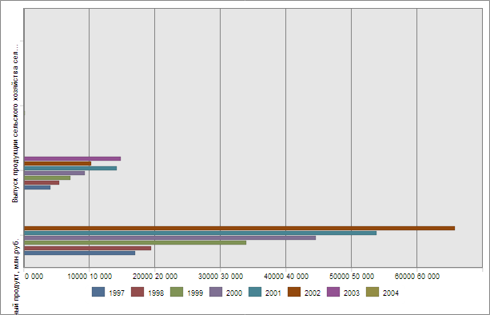

# EaxChartView.Options

EaxChartView.Options
-

**

# EaxChartView.Options

## Синтаксис

Options: Object

## Описание

Свойство Options** содержит настройки диаграммы экспресс-отчета.

## Комментарии

Значение свойства устанавливается с помощью метода setOptions, а возвращается с помощью метода getOptions. Из JSON значение свойства установить нельзя.

## Пример

Для выполнения примера необходимо наличие на html-странице компонента [ExpressBox](../../../Components/Express/ExpressBox/ExpressBox.htm) с наименованием «expressBox» (см. «[Пример создания компонента ExpressBox](../../../Components/Express/ExpressBox/ExpressBox_Example.htm)») и с загруженной диаграммой в рабочей области экспресс-отчета. Инвертируем данную диаграмму:

// Получаем представление диаграммы экспресс-отчета
var chartView = expressBox.getDataView().getChartView();
var options;
// Получаем настройки диаграммы
if (chartView.getInstance() && chartView.getInstance().options) {
    options = chartView.getInstance().options;
} else {
    options = chartView.getOptions();
}
// Инвертируем диаграмму
options.chart.inverted = true;
chartView.setInstance(options);

В результате выполнения примера диаграмма будет инвертирована:

См. также:

[EaxChartView](EaxChartView.htm)

		Справочная
		 система на версию 10.9
		 от 18/08/2025,
		 © ООО «ФОРСАЙТ»,
