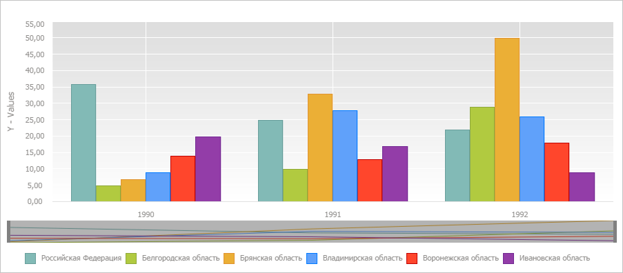
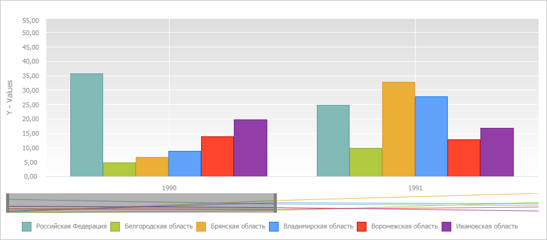
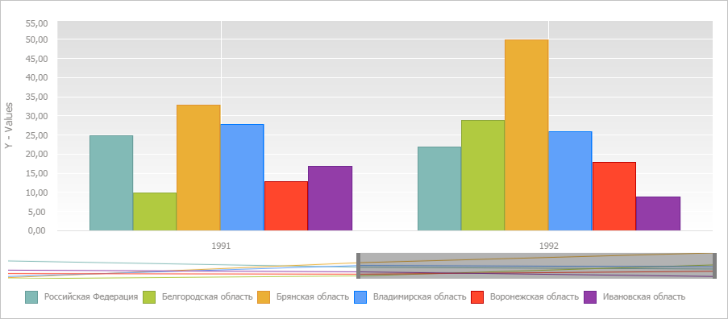

# EaxChartView.ScrollerEnabled

EaxChartView.ScrollerEnabled
-

# EaxChartView.ScrollerEnabled

## Синтаксис

ScrollerEnabled: Boolean;

## Описание

Свойство ScrollerEnabled определяет
 наличие элемента прокрутки у диаграммы экспресс-отчета.

## Комментарии

Допустимые значения:

	- true.
	 Элемент прокрутки активирован у диаграммы;

	- false.
	 Элемент прокрутки у диаграммы отсутствует (по умолчанию).

Значение свойства задается с помощью метода setScrollerEnabled,
 а возвращается с помощью метода getScrollerEnabled.
 Из JSON значение задать нельзя.

## Пример

Для выполнения примера необходимо наличие на html-странице компонента
 [ExpressBox](../../../Components/Express/ExpressBox/ExpressBox.htm)
 с наименованием «expressBox» (см. «[Пример
 создания компонента ExpressBox](../../../Components/Express/ExpressBox/ExpressBox_Example.htm)») и с загруженной диаграммой в области
 данных. Активируем элемент прокрутки у диаграммы:

// Получаем представление диаграммы
var chartView = expressBox.getDataView().getChartView();
// Активируем элемент прокрутки у диаграммы
chartView.setScrollerEnabled(true);
В результате у диаграммы появился элемент прокрутки:

Установим количество шагов временной шкалы, для которых будет отображаться
 диаграмма:

// Устанавливаем количество шагов временной шкалы, для которых будет отображаться диаграмма
chartView.setScrollerMaxPointsInSight(1);
В результате данные были отображены только для шагов «1990» и «1991»:

Установим новую позицию элемента прокрутки:

// Устанавливаем новую позицию элемента прокрутки
chartView.setScrollerPosition(1);
В результате данные были отображены для шагов «1991» и «1992»:

См. также:

[EaxChartView](EaxChartView.htm)

		Справочная
		 система на версию 10.9
		 от 18/08/2025,
		 © ООО «ФОРСАЙТ»,
