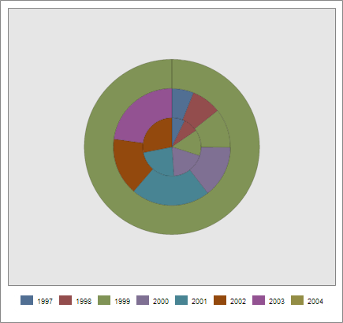

# EaxChartView.refreshJSON

EaxChartView.refreshJSON
-

**

# EaxChartView.refreshJSON

## Синтаксис

refreshJSON(hcJson);

## Параметры

*hcJson.* Новые настройки для диаграммы экспресс-отчета.

## Описание

Метод refreshJSON** обновляет диаграмму экспресс-отчета по указанному JSON-объекту.

## Пример

Для выполнения примера необходимо наличие на html-странице компонента [ExpressBox](../../../Components/Express/ExpressBox/ExpressBox.htm) с наименованием «expressBox» (см. «[Пример создания компонента ExpressBox](../../../Components/Express/ExpressBox/ExpressBox_Example.htm)») и с загруженной диаграммой в рабочей области экспресс-отчета. Изменим в настройках тип диаграммы и затем обновим её согласно внесенным изменениям:

// Получаем представление диаграммы экспресс-отчета
var chartView = expressBox.getDataView().getChartView();
// Получаем экземпляр диаграммы экспресс-отчета
var instance = chartView.getInstance();
// Изменим тип диаграммы
instance.options.chart.defaultSeriesType = "pie";
chartView.refreshJSON(instance.options);

В результате выполнения примера диаграмма экспресс-отчета станет круговой:

См. также:

[EaxChartView](EaxChartView.htm)

		Справочная
		 система на версию 10.9
		 от 18/08/2025,
		 © ООО «ФОРСАЙТ»,
