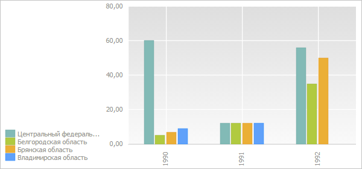

# EaxChartView.resetLabels

EaxChartView.resetLabels
-

# EaxChartView.resetLabels

## Синтаксис

resetLabels(enable: Boolean, resetFormatter: Boolean, resetStyle: Boolean, resetAlign: Boolean, resetRotation: Boolean, resetColor: Boolean);

## Параметры

enable. Признак доступности подписей для рядов диаграммы. Если параметр равен значению true, то подписи будут отображаться, иначе - не будут;

resetFormatter. Признак сброса формата подписей. Если параметр равен значению true, то формат будет сброшен, иначе - не будет;

resetStyle. Признак сброса стиля подписей. Если параметр равен значению true, то стиль будет сброшен, иначе - не будет;

resetAlign. Признак сброса стиля выравнивания подписей. Если параметр равен значению true, то стиль будет сброшен, иначе - не будет;

resetRotation. Признак сброса настроек поворота подписей. Если параметр равен значению true, то настройки будут удалены, иначе - не будут;

resetColor. Признак сброса настроек цвета подписей. Если параметр равен значению true, то настройки будут удалены, иначе - не будут.

## Описание

Метод resetLabels сбрасывает настройки подписей всех рядов диаграммы.

## Комментарии

Метод возвращает JSON-объект с исходными настройками подписей для первого ряда данных.

## Пример

Для выполнения примера необходимо сначала запустить сценарий, приведённый на странице описания свойства [EaxChartView.LegendPosition](EaxChartView.LegendPosition.htm). Теперь скроем надписи для всех рядов диаграммы:

// Сбросим настройки подписей всех рядов
chartView.resetLabels(false);
// Обновим диаграмму
chartView.refreshView(chartView.getInstance().options);

В результате выполнения примера надписи для всех рядов диаграммы будут скрыты:

См. также:

[EaxChartView](EaxChartView.htm)

		Справочная
		 система на версию 10.9
		 от 18/08/2025,
		 © ООО «ФОРСАЙТ»,
