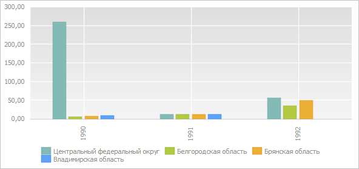
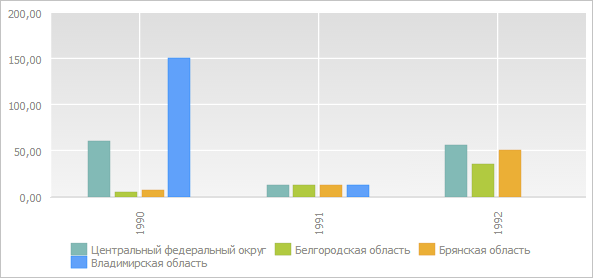

# EaxChartView.setPointValue

EaxChartView.setPointValue
-

**

# EaxChartView.setPointValue

## Синтаксис

setPointValue(value: Number, serie: Number, point:
 Number, fireEvent);

## Параметры

*value.* Присваиваемое
 значение;

*serie.* Определяет ряд
 диаграммы, к которой относится точка диаграммы;

*point.* Определяет точку
 в указанного ряда;

*fireEvent.* Параметр, определяющий,
 будет ли сгенерировано соответствующее событие после выполнения метода.
 По умолчанию установлено значение true.
 Если установлено значение false,
 событие генерироваться не будет.

## Описание

Метод setPointValue** устанавливает
 значение для указанной точки диаграммы экспресс-отчета.

## Пример

Для выполнения примера необходимо наличие на html-странице компонента
 [ExpressBox](../ExpressBox/ExpressBox.htm) с наименованием
 «expressBox» (см. [Пример
 создания компонента ExpressBox](../../../Components/Express/ExpressBox/ExpressBox_Example.htm)) и с загруженной диаграммой в
 рабочей области экспресс-отчета. Установим значение для определённой точки
 данной диаграммы:

// Получаем представление диаграммы экспресс-отчета
var chartView = expressBox.getDataView().getChartView();
// Устанавливаем значение для точки диаграммы экспресс-отчета
var serie = 3; // Ряд диаграммы
var point = 0; // Значение в указанном ряду
chartView.setPointValue(150, serie, point, true);

До выполнения примера диаграмма экспресс-отчета имела следующий вид:

После выполнения примера было установлено новое значение в качестве
 первого значения четвёртой серии данных диаграммы:

Далее откатим сделанные изменения:

chartView.undoData();
После выполнения данной строки кода диаграмма экспресс-отчета будет
 иметь первоначальный вид. Аналогичное изменение будет выполнено, если
 обновить диаграмму:

chartView.refresh();
См. также:

[EaxChartView](EaxChartView.htm)

		Справочная
		 система на версию 10.9
		 от 18/08/2025,
		 © ООО «ФОРСАЙТ»,
