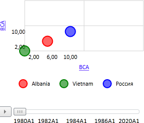

# EaxDataView.getBubbleChartView

EaxDataView.getBubbleChartView
-

**

# EaxDataView.getBubbleChartView

## Синтаксис

getBubbleChartView();

## Описание

Метод getBubbleChartView
 возвращает представление данных «Пузырьковая
 диаграмма»** в рабочей области экспресс-отчета.

## Пример

Для выполнения примера необходимо наличие на html-странице компонента
 [ExpressBox](../ExpressBox/ExpressBox.htm) с наименованием
 «expressBox» (см. [Пример
 создания компонента ExpressBox](../../../Components/Express/ExpressBox/ExpressBox_Example.htm)). Далее получим представление данных
 **«Пузырьковая диаграмма» и установим
 для него новую ширину и высоту:**

// Получаем объект класса EaxDataView
var dataView = expressBox.getDataView();
dataView.getBubbleChartView().setWidth(300);
dataView.getBubbleChartView().setHeight(255);

В результате выполнения данного примера представление данных «Пузырьковая
 диаграмма» будет иметь ширину 300 и высоту 255 пиксела:

См. также:

[EaxDataView](EaxDataView.htm)

		Справочная
		 система на версию 10.9
		 от 18/08/2025,
		 © ООО «ФОРСАЙТ»,
