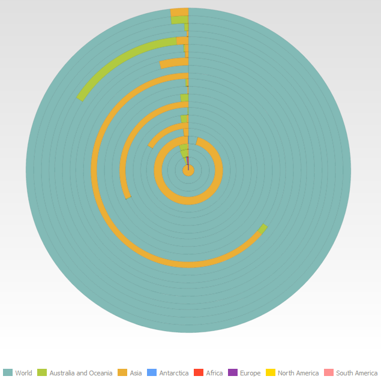

# EaxDataView.getChartView

EaxDataView.getChartView
-

**

# EaxDataView.getChartView

## Синтаксис

getChartView();

## Описание

Метод getChartView** **возвращает представление данных «Диаграмма»** в рабочей области экспресс-отчета.

## Пример

Для выполнения примера необходимо наличие на html-странице компонента [ExpressBox](../ExpressBox/ExpressBox.htm) с наименованием «expressBox» (см. [Пример создания компонента ExpressBox](../../../Components/Express/ExpressBox/ExpressBox_Example.htm)). Установим для диаграммы тип «Круговая»:

// Получаем объект класса EaxDataView
var dataView = expressBox.getDataView();
dataView.getChartView().setChartType("pie");

В результате выполнения примера диаграмма, являющаяся по умолчанию линейной, станет круговой:

См. также:

[ EaxDataView](EaxDataView.htm)

		Справочная
		 система на версию 10.9
		 от 18/08/2025,
		 © ООО «ФОРСАЙТ»,
