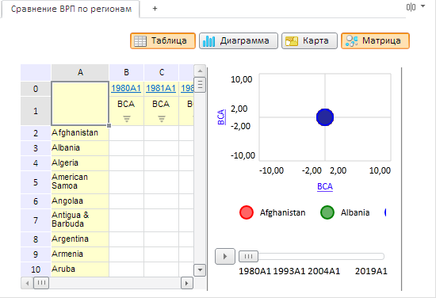

# EaxDataView.getModeSelectorView

EaxDataView.getModeSelectorView
-

**

# EaxDataView.getModeSelectorView

## Синтаксис

getModeSelectorView();

## Описание

Метод getModeSelectorView** возвращает кнопку для выбора режима отображения представлений данных.

## Пример

Для выполнения примера необходимо наличие на html-странице компонента [ExpressBox](../ExpressBox/ExpressBox.htm) с наименованием «expressBox» (см. [Пример создания компонента ExpressBox](../../../Components/Express/ExpressBox/ExpressBox_Example.htm)). Далее установим с помощью перечисления PP.Exp.Ui.[EaxModeSelectorType](../../../Enums/EaxModeSelectorType.htm) режим отображения представления данных «Горизонтально»:

// Получаем объект класса EaxDataView
var dataView = expressBox.getDataView();
// Получаем представление кнопки «Раскладка»
var modeSelector = dataView.getModeSelectorView();
modeSelector.setModeSelectorState(PP.Exp.Ui.EaxModeSelectorType.Horizontal);

В результате выполнения примера будет установлен режим отображения представления данных «Горизонтально». Если выбрать кнопки «Таблица» и «пузырьковая диаграмма», то соответствующие представления будут изображены в ряд горизонтально:

См. также:

[ EaxDataView](EaxDataView.htm)

		Справочная
		 система на версию 10.9
		 от 18/08/2025,
		 © ООО «ФОРСАЙТ»,
