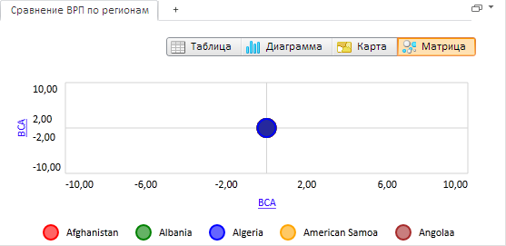

# EaxDataView.getToolBarView

EaxDataView.getToolBarView
-

**

# EaxDataView.getToolBarView

## Синтаксис

getToolBarView();

## Описание

Метод getToolBarView**
 возвращает группу кнопок для выбора варианта представления данных.

## Пример

Для выполнения примера необходимо наличие на html-странице компонента
 [ExpressBox](../ExpressBox/ExpressBox.htm) с наименованием
 «expressBox» (см. [Пример
 создания компонента ExpressBox](../../../Components/Express/ExpressBox/ExpressBox_Example.htm)). Сделаем активной кнопку «Пузырьковая
 диаграмма»:

// Получаем объект класса EaxDataView
var dataView = expressBox.getDataView();
dataView.getToolBarView().setActiveObject(PP.Exp.Ui.EaxObjectType.BubbleChart)

В результате выполнения примера активной стала кнопка «Пузырьковая диаграмма»,
 а в рабочую область экспресс-отчета было загружено соответствующее представление
 данных:

См. также:

[ EaxDataView](EaxDataView.htm)

		Справочная
		 система на версию 10.9
		 от 18/08/2025,
		 © ООО «ФОРСАЙТ»,
