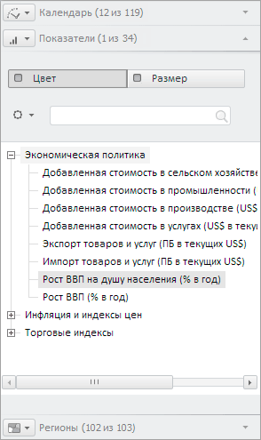

# EaxDimBarMaster.Mode

EaxDimBarMaster.Mode
-

# EaxDimBarMaster.Mode

## Синтаксис

Mode: String

## Описание

Свойство Mode определяет режим
 отображения мастера.

## Комментарии

Режим отображения зависит от представления данных, отметка для которого
 настраивается в мастере. Доступны следующие значения: Grid, Chart, Map,
 BubbleChart, BubbleTree, TreeMap. Для режимов Map, BubbleChart, BubbleTree
 и TreeMap доступна настройка по двум показателям: цвет и размер (для 3d-карты
 - объём).

Например, при установке режима TreeMap панель для изменения отметки
 в измерении показателей будет выглядеть как показано на рисунке ниже,
 к тому же изменятся пиктограммы для панелей измерений:

Значение свойства устанавливается из JSON при помощи метода setMode,
 а возвращается методом getMode.

## Пример

Пример использования свойства приведен на странице «[Пример
 создания компонента EaxDimBarMaster](../../../Components/Express/EaxDimBarMaster/EaxDimBarMaster_Example.htm)».

См. также:

[EaxDimBarMaster](EaxDimBarMaster.htm)

		Справочная
		 система на версию 10.9
		 от 18/08/2025,
		 © ООО «ФОРСАЙТ»,
