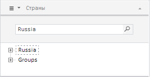
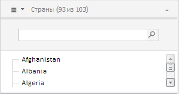

# EaxDimBarMasterPanel.clearFilter

EaxDimBarMasterPanel.clearFilter
-

**

# EaxDimBarMasterPanel.clearFilter

## Синтаксис

clearFilter();

## Описание

Метод clearFilter** сбрасывает
 фильтр с дерева на панелях в мастере управления отметкой.

## Пример

Для выполнения примера необходимо наличие на html-странице компонента
 [ExpressBox](../ExpressBox/ExpressBox.htm) с наименованием
 «expressBox» (см. [Пример
 создания компонента ExpressBox](../../../Components/Express/ExpressBox/ExpressBox_Example.htm)). Далее сбросим фильтр с дерева на
 одной из панелей мастера управления отметкой:

var dimBarMaster = expressBox.getPropertyBarView().getDimBarMasterView();
// Покажем панель
dimBarMaster.show();
// Получим ключ первого измерения
var dimKey = dimBarMaster.getCurrentState().dims.its.it[0].k;
var masterPanel = dimBarMaster.getPanelByDimKey(dimKey);
// Получим источник данных панели
var source = masterPanel.getSource();
console.log("Key: " + source.getKey() + ", Name: " + source.getName());
// Cбросим фильтр на панелях в мастере управления отметкой
masterPanel.clearFilter();

В результате выполнения примера, во-первых, в консоли браузера будет
 выведена информация об источнике данных панели мастера - её ключ и наименование
 :

Key: 1646, Name: Страны

Первоначально для дерева измерения на панели «Страны» был указан фильтр
 «Russia»:

После выполнения указанного примера фильтр с дерева сбросится:

См. также:

[EaxDimBarMasterPanel](EaxDimBarMasterPanel.htm)

		Справочная
		 система на версию 10.9
		 от 18/08/2025,
		 © ООО «ФОРСАЙТ»,
