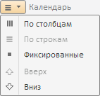
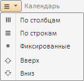

# EaxDimBarMasterPanel.refreshMenuItems

EaxDimBarMasterPanel.refreshMenuItems
-

**

# EaxDimBarMasterPanel.refreshMenuItems

## Синтаксис

refreshMenuItems();

## Описание

Метод refreshMenuItems**
 обновляет пункты меню для заголовка панели в мастере управления отметкой.

## Комментарии

Меню для заголовка панели в мастере управления отметкой может выглядеть
 следующим образом:

Метод делает недоступными некорректные пункты меню.

## Пример

Для выполнения примера необходимо наличие на html-странице компонента
 [ExpressBox](../ExpressBox/ExpressBox.htm) с наименованием
 «expressBox» (см. [Пример
 создания компонента ExpressBox](../../../Components/Express/ExpressBox/ExpressBox_Example.htm)). Обновим пункты меню для заголовка
 панели мастера:

var dimBarMaster = expressBox.getPropertyBarView().getDimBarMasterView();
// Покажем панель
dimBarMaster.show();
// Индекс панели
var itemIndex = 0;
var hlDim = dimBarMaster.getId(itemIndex);
// Получим ключ первого измерения
var dimKey = dimBarMaster.getCurrentState().dims.its.it[0].k;
var masterPanel = dimBarMaster.getPanelByDimKey(dimKey);
// Получим источник данных панели
var source = masterPanel.getSource();
console.log("Key: " + source.getKey() + ", Name: " + source.getName());
var items = masterPanel.getHeaderControl()
    .getMenu()
    .getItems();
for (var i = 0; i < items.length; i++) {
    items[i].setEnabled(true);
    }
alert("Все пункты меню стали доступными");
masterPanel.refreshMenuItems();

Все пункты меню становятся доступными после вывода соответствующего
 сообщения:

При этом в консоли браузера выводится ключ и наименование измерения,
 с которым работаем:

Key: 2038, Name: Календарь

После нажатия на кнопку OK меню для заголовка панели мастера обновляется,
 т.е. некорректные пункты становятся недоступными:

См. также:

[EaxDimBarMasterPanel](EaxDimBarMasterPanel.htm)

		Справочная
		 система на версию 10.9
		 от 18/08/2025,
		 © ООО «ФОРСАЙТ»,
