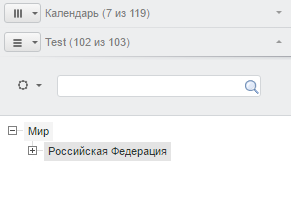
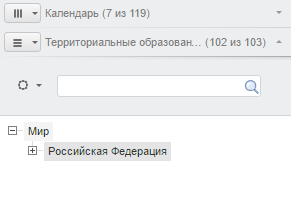

# EaxDimBarMasterPanel.refreshTitleLabel

EaxDimBarMasterPanel.refreshTitleLabel
-

# EaxDimBarMasterPanel.refreshTitleLabel

## Синтаксис

refreshTitleLabel();

## Описание

Метод refreshTitleLabel обновляет
 заголовок панели в мастере управления отметкой.

## Пример

Для выполнения примера необходимо наличие на html-странице компонента
 [ExpressBox](../ExpressBox/ExpressBox.htm) с наименованием
 «expressBox» (см. [Пример
 создания компонента ExpressBox](../../../Components/Express/ExpressBox/ExpressBox_Example.htm)). Далее изменим и обновим заголовок
 панели на актуальный:

// Получаем активную панель в мастере управления отметкой
var title = expressBox.getPropertyBarView().getActivePanel();
// Меняем заголовок панели
title.getHeader().getItems()[1].getDomNode().firstChild.childNodes[0].innerHTML = 'Test';
// Обновляем заголовок на актуальный
title.refreshTitleLabel();
В результате выполнения примера изменится заголовок активной панели
 на «Test»:

После обновления появится исходный заголовок:

См. также:

[EaxDimBarMasterPanel](EaxDimBarMasterPanel.htm)

		Справочная
		 система на версию 10.9
		 от 18/08/2025,
		 © ООО «ФОРСАЙТ»,
