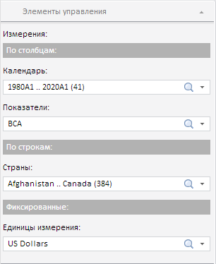
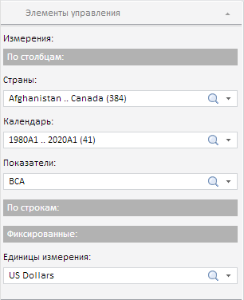

# EaxDimBarView.moveDim

EaxDimBarView.moveDim
-

**

# EaxDimBarView.moveDim

## Синтаксис

moveDim(dimKey, dimPosition, index);

## Параметры

*dimKey.* Ключ измерения,
 которое нужно переместить;

*dimPosition.* Позиция, в которую нужно переместить измерение;
 задаётся с помощью элемента перечисления PP.Exp.[PvtDimPos](../../../Enums/PvtDimPos.htm);

*index.* Индекс расположения в данной позиции.

## Описание

Метод moveDim** перемещает измерение в указанную позицию.

## Комментарии

Метод возвращает значение true,
 если измерение переместилось, и false,
 если нет.

## Пример

Для выполнения примера необходимо наличие на html-странице компонента
 [ExpressBox](../ExpressBox/ExpressBox.htm) с наименованием
 «expressBox» (см. [Пример
 создания компонента ExpressBox](../../../Components/Express/ExpressBox/ExpressBox_Example.htm)). Расположим измерение по столбцам
 в первой позиции:

var dimBar = expressBox.getPropertyBarView().getDimBarViewPanel();
dimBar.DimensionMoved.add(function(sender, args) {
    // Выведем новую позицию измерения
    console.log("Moved position: " + args.DimPosition + ", index: " + args.Index);
});
// Покажем мастер управления отметкой
dimBar.show();
// Раскроем панель
dimBar.expand(true);
// Получим ключ первого измерения
var dimKey = dimBar.getCurrentState().dims.its.it[0].k;
// Выведем ключ измерения и его позицию
console.log("Key: " + dimKey + ", position: " + dimBar.getCurrentState().dims.its.it[0].position);
// Изменим расположение измерения
dimBar.moveDim(dimKey, PP.Exp.PvtDimPos.Top, 0, true);

До выполнения примера измерение «Страны» с ключом 1646 было расположено
 по строкам:

После выполнения примера данное измерение стало располагаться по столбцам
 и находиться в первой позиции:

Также в результате выполнения примера в консоль браузера была выведена
 информация об измерении до и после его перемещения:

Key: 1646, position: Left

Moved position: Top, index: 0

См.
 также:

[EaxDimBarView](EaxDimBarView.htm)

		Справочная
		 система на версию 10.9
		 от 18/08/2025,
		 © ООО «ФОРСАЙТ»,
