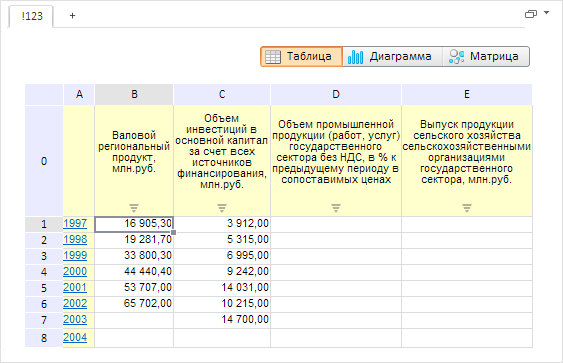

# EaxDocument.checkSheetName

EaxDocument.checkSheetName
-

**

# EaxDocument.checkSheetName

## Синтаксис

checkSheetName(newSheetName);

## Параметры

*newSheetName.* Новое
 название листа документа экспресс-отчета.

## Описание

Метод checkSheetName**
 проверяет правильность наименования листа документа экспресс-отчета.

## Комментарии

Метод возвращает значение false,
 если наименование листа документа экспресс-отчета неправильное, т. е.
 если оно пустое или совпадает с наименованием уже существующего листа.
 Иначе метод возвращает значение true.

Критерии недопустимости наименования листа определяются элементами перечисления
 [PP.Exp.EaxDocument.SheetNameError](../../../Enums/EaxDocument.SheetNameError.htm).

## Пример

Для выполнения примера необходимо наличие на html-странице компонента
 [ExpressBox](../../../Components/Express/ExpressBox/ExpressBox.htm)
 с наименованием «expressBox» (см. «[Пример
 создания компонента ExpressBox](../../../Components/Express/ExpressBox/ExpressBox_Example.htm)»). Переименуем активный лист документа
 экспресс-отчета, предварительно проверив новое наименование листа на правильность:

// Получаем документ экспресс-отчета
var eaxDocument = expressBox.getSource();
var sheetName = "!123";
var result = eaxDocument.checkSheetName(sheetName);
if (result) {
    // Получим активный лист
    var sheet = eaxDocument.getActiveSheet();
    // Переименовываем лист документа
    var sheets = eaxDocument.getDocumentMetadata().sheets.its.it;
    for (var i = 0; i < sheets.length; i++) {
        if (sheets[i].k == sheet.getKey()) {
            sheets[i].n = sheetName;
        }
    }
    console.log("Новое имя листа экспресс-отчета: " + eaxDocument.getSheetName(sheet.getKey()));
} else {
    console.log("Наименование листа является не верным. Лист не будет переименован.");
}
// Обновляем экспресс-отчет, чтобы увидеть обновленный заголовок листа
expressBox.refreshAll();

В результате выполнения примера активный лист документа экспресс-отчета
 был переименован:

Новое наименование листа также было выведено в консоли браузера:

Новое имя листа экспресс-отчета: !123

См. также:

[EaxDocument](EaxDocument.htm)

		Справочная
		 система на версию 10.9
		 от 18/08/2025,
		 © ООО «ФОРСАЙТ»,
