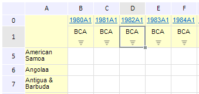

# EaxGridView.Selection

EaxGridView.Selection
-

**

# EaxGridView.Selection

## Синтаксис

Selection: Object

## Описание

Свойство Selection** выделяет указанные ячейки таблицы в рабочей области экспресс-отчета.

## Комментарии

Значение свойства Selection задается при помощи метода setSelection и возвращается при помощи метода getSelection. Из JSON значение свойства задать нельзя

## Пример

Для выполнения примера необходимо наличие на html-странице компонента ExpressBox с наименованием «expressBox» (см. «[Пример создания компонента ExpressBox](../../../Components/Express/ExpressBox/ExpressBox_Example.htm)»). Выделим ячейку :

// Получим представление таблицы
var gridView = expressBox.getDataView().getGridView();
// Установим область выделения ячеек таблицы
gridView.setSelection(
    JSON.parse("{\"range\":{\"address\":\"D1\",\"height\":1,\"left\":3," +
    "\"top\":1,\"type\":\"Cells\",\"width\":1},\"type\":\"Normal\"}"));

В результате выполнения примера будет выделена ячейка D1:

См. также:

[EaxGridView](EaxGridView.htm)

		Справочная
		 система на версию 10.9
		 от 18/08/2025,
		 © ООО «ФОРСАЙТ»,
