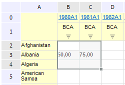

# EaxGridView.clearSelection

EaxGridView.clearSelection
-

**

# EaxGridView.clearSelection

## Синтаксис

clearSelection();

## Описание

Метод clearSelection** убирает выделение в таблице рабочей области экспресс-отчета.

## Пример

Для выполнения примера необходимо наличие на html-странице компонента EaxGrid с наименованием «eaxGrid» (см. «[Пример создания компонента EaxGrid](../../../Components/Express/EaxGrid/EaxGrid_Example.htm)»). Далее снимем выделение в таблице рабочей области экспресс-отчета:

// Уберем выделение в таблице рабочей области экспресс-отчета
eaxGrid.clearSelection();

До применения метода таблица выглядела следующим образом:

После применения метода было снято выделение в таблице рабочей области экспресс-отчета:

См. также:

[EaxGridView](EaxGridView.htm)

		Справочная
		 система на версию 10.9
		 от 18/08/2025,
		 © ООО «ФОРСАЙТ»,
