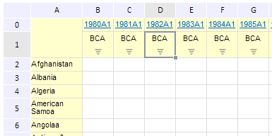

# EaxGridView.getCellCoords

EaxGridView.getCellCoords
-

**

# EaxGridView.getCellCoords

## Синтаксис

getCellCoords();

## Описание

Метод getCellCoords** возвращает
 координаты левой верхней угловой ячейки таблицы в выбранном диапазоне.

## Пример

Для выполнения примера необходимо наличие на html-странице компонента
 ExpressBox с наименованием «expressBox»
 (см. «[Пример
 создания компонента ExpressBox](../../../Components/Express/ExpressBox/ExpressBox_Example.htm)»). Определим координаты левой верхней
 угловой ячейки таблицы в выбранном диапазоне:

var coords = expressBox.getDataView().getGridView().getCellCoords();
console.log("Column index: " + coords.colIndex);
console.log("Row index: " + coords.rowIndex);

Допустим, что в таблице выделена следующая ячейка:

В результате выполнения данного примера в консоли браузера будут выведены
 следующие строчки:

Column index: 3

Row index: 1

См. также:

[EaxGridView](EaxGridView.htm)

		Справочная
		 система на версию 10.9
		 от 18/08/2025,
		 © ООО «ФОРСАЙТ»,
