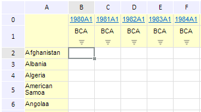

# EaxGridView.getFocusedCell

EaxGridView.getFocusedCell
-

**

# EaxGridView.getFocusedCell

## Синтаксис

getFocusedCell();

## Описание

Метод getFocusedCell** возвращает ячейку таблицы, находящуюся в фокусе.

## Пример

Для выполнения примера необходимо наличие на html-странице компонента ExpressBox с наименованием «expressBox» (см. «[Пример создания компонента ExpressBox](../../../Components/Express/ExpressBox/ExpressBox_Example.htm)»). Пусть под фокусом находится следующая ячейка таблицы:

Тогда выведем координаты выделенной ячейки:

var focusedCell = expressBox.getDataView().getGridView().getFocusedCell();
console.log("Column index: " + focusedCell.colIndex);
console.log("Row index: " + focusedCell.rowIndex);

В результате выполнения данного примера в консоли браузера будут выведены координаты выделенной ячейки:

Column index: 1

Row index: 2

См. также:

[EaxGridView](EaxGridView.htm)

		Справочная
		 система на версию 10.9
		 от 18/08/2025,
		 © ООО «ФОРСАЙТ»,
