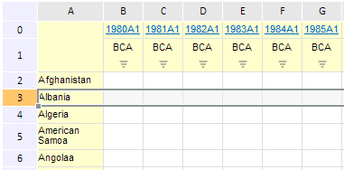

# EaxGridView.getSelectionType

EaxGridView.getSelectionType
-

**

# EaxGridView.getSelectionType

## Синтаксис

getSelectionType();

## Описание

Метод getSelectionType** возвращает тип выделенного объекта.

## Пример

Для выполнения примера необходимо наличие на html-странице компонента ExpressBox с наименованием «expressBox» (см. «[Пример создания компонента ExpressBox](../../../Components/Express/ExpressBox/ExpressBox_Example.htm)»). Получим тип выделенного объекта, показанного на рисунке:

Для этого выполним данный скрипт:

var gridView = expressBox.getDataView().getGridView();
// Выводим тип выделенного объекта
console.log(gridView.getSelectionType());

В результате выполнения примера в консоли браузера будет выведен тип выделенного элемента:

"Row"

См. также:

[EaxGridView](EaxGridView.htm)

		Справочная
		 система на версию 10.9
		 от 18/08/2025,
		 © ООО «ФОРСАЙТ»,
