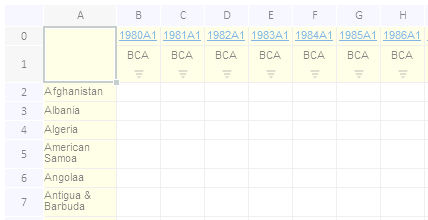

# EaxGridView.getTabSheet

EaxGridView.getTabSheet
-

**

# EaxGridView.getTabSheet

## Синтаксис

getTabSheet();

## Описание

Метод getTabSheet** возвращает лист с таблицей в рабочей области экспресс-отчета.

## Пример

Для выполнения примера необходимо наличие на html-странице компонента ExpressBox с наименованием «expressBox» (см. «[Пример создания компонента ExpressBox](../../../Components/Express/ExpressBox/ExpressBox_Example.htm)»). Сделаем таблицу неактивной:

var tabSheet = expressBox.getDataView().getGridView().getControl();
// Делаем таблицу неактивной
tabSheet.setEnabled(false);

В результате выполнения данного примера таблица стала неактивной:

См. также:

[EaxGridView](EaxGridView.htm)

		Справочная
		 система на версию 10.9
		 от 18/08/2025,
		 © ООО «ФОРСАЙТ»,
