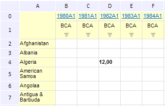

# EaxGridView.setCellValue

EaxGridView.setCellValue
-

**

# EaxGridView.setCellValue

## Синтаксис

setCellValue(value, row: Number, column: Number, selection: Boolean, fireEvent: Boolean);

## Параметры

*value.* Устанавливаемое значение;

*row.* Индекс строки без учёта фиксации;

*column.* Индекс столбца без учёта фиксации;

*selection.* Признак того, учитывать ли текущее выделение ячеек при изменении в них значения. Необязательный параметр;

*fireEvent.* Определяет, генерировать ли событие DataChanged. Необязательный параметр.

## Описание

Метод setCellValue** устанавливает значение ячейки таблицы в рабочей области экспресс-отчета.

## Пример

Для выполнения примера необходимо наличие на html-странице компонента ExpressBox с наименованием «expressBox» (см. «[Пример создания компонента ExpressBox](../../../Components/Express/ExpressBox/ExpressBox_Example.htm)»). Установим значение для ячейки таблицы во второй строке и во втором столбце:

// Получим представление таблицы
var gridView = expressBox.getDataView().getGridView();
// Установим значение для ячейки таблицы
gridView.setCellValue(12, 2, 2);

В результате выполнения примера будет установлено значение 12 во второй строке и во втором столбце таблицы:

См. также:

[EaxGridView](EaxGridView.htm)

		Справочная
		 система на версию 10.9
		 от 18/08/2025,
		 © ООО «ФОРСАЙТ»,
