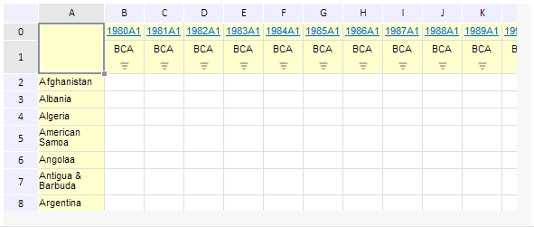

# EaxGridView.setScroll

EaxGridView.setScroll
-

**

# EaxGridView.setScroll

## Синтаксис

setScroll(scroll, value: boolean);

## Параметры

*scroll.* Тип полосы прокрутки - вертикальный или горизонтальный.

*value.* Управляет видимостью полосы прокрутки.

## Описание

Метод setScroll** устанавливает полосы прокрутки для таблицы в рабочей области экспресс-отчета.

## Пример

Для выполнения примера необходимо наличие на html-странице компонента ExpressBox с наименованием «expressBox» (см. «[Пример создания компонента ExpressBox](../../../Components/Express/ExpressBox/ExpressBox_Example.htm)»). Отключим полосы прокрутки у таблицы:

// Получим представление таблицы
var gridView = expressBox.getDataView().getGridView();
// Отключим горизонтальную полосу прокрутки
gridView.setScroll(PP.Exp.Ui.TableEnum.HScroll, false);
// Отключим вертикальную полосу прокрутки
gridView.setScroll(PP.Exp.Ui.TableEnum.VScroll, false);

В результате выполнения примера у таблицы будут отключены горизонтальная и вертикальная полоса прокрутки:

См. также:

[EaxGridView](EaxGridView.htm)

		Справочная
		 система на версию 10.9
		 от 18/08/2025,
		 © ООО «ФОРСАЙТ»,
