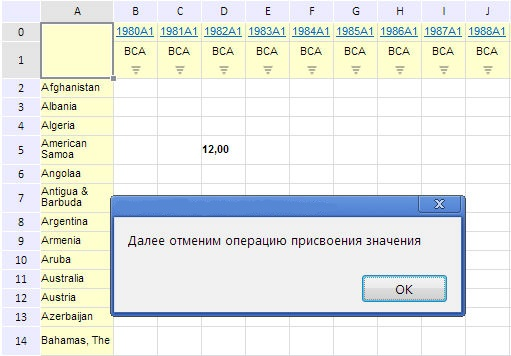

# EaxGridView.undo

EaxGridView.undo
-

**

# EaxGridView.undo

## Синтаксис

undo();

## Описание

Метод undo** осуществляет
 отмену последней операции, произведённой с таблицей в рабочей области
 экспресс-отчета.

## Пример

Для выполнения примера необходимо наличие на html-странице компонента
 ExpressBox с наименованием «expressBox»
 (см. «[Пример
 создания компонента ExpressBox](../../../Components/Express/ExpressBox/ExpressBox_Example.htm)»). Присвоим ячейке таблицы некоторое
 значение, а затем отменим операцию:

// Получим представление таблицы
var gridView = expressBox.getDataView().getGridView();
// Присвоим ячейки некоторое значение
gridView.setCellValue(12, 3, 2);
// Выведем простое сообщение
alert("Далее отменим операцию присвоения значения");
// Отменим операцию присвоения значения
gridView.undo();

Сначала было установлено значение в ячейку D5:

После нажатия на кнопку «OK» предыдущая операция была отменена:

См. также:

[EaxGridView](EaxGridView.htm)

		Справочная
		 система на версию 10.9
		 от 18/08/2025,
		 © ООО «ФОРСАЙТ»,
