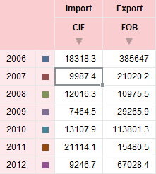

# EaxGridView.updateLegendColumn

EaxGridView.updateLegendColumn
-

# EaxGridView.updateLegendColumn

## Синтаксис

updateLegendColumn();

## Описание

Метод updateLegendColumn обновляет столбец с легендой для диаграммы.

## Комментарии

Таблица, имеющая столбец с легендой для диаграммы, представлена на следующем рисунке:

## Пример

Пример использования метода приведен на странице «[Пример создания компонента axGrid](../../../Components/Express/EaxGrid/EaxGrid_Example.htm)».

См. также:

[EaxGridView](EaxGridView.htm)

		Справочная
		 система на версию 10.9
		 от 18/08/2025,
		 © ООО «ФОРСАЙТ»,
