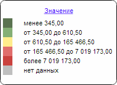

# EaxMapView.IsLegendHeaderClickable

EaxMapView.IsLegendHeaderClickable
-

**

# EaxMapView.IsLegendHeaderClickable

## Синтаксис

IsLegendHeaderClickable: Boolean

## Описание

Свойство IsLegendHeaderClickable** содержит признак того, что заголовок легенды карты экспресс-отчета представлен в виде гиперссылки.

## Комментарии

Если свойство принимает значение true, то заголовок легенды представлен в виде гиперссылки, если false - то в виде простого текста. По умолчанию имеет значение true.

Значение свойства можно установить с помощью метода setIsLegendHeaderClickable, а возвратить - с помощью метода getIsLegendHeaderClickable. Из JSON значение свойства установить нельзя.

## Пример

Для выполнения примера необходимо наличие на html-странице компонента [ExpressBox](../../../Components/Express/ExpressBox/ExpressBox.htm) с наименованием «expressBox» (см. «[Пример создания компонента ExpressBox](../../../Components/Express/ExpressBox/ExpressBox_Example.htm)») и с загруженной картой в рабочей области. Оформим заголовок легенды у карты экспресс-отчета в виде простого текста:

// Получим представление карты экспресс-отчета
var eaxMapView = expressBox.getDataView().getMapView();
eaxMapView.setIsLegendHeaderClickable(false);

В результате выполнения примера заголовок легенды карты будет представлен в виде простого текста:

См. также:

[EaxMapView](EaxMapView.htm)

		Справочная
		 система на версию 10.9
		 от 18/08/2025,
		 © ООО «ФОРСАЙТ»,
