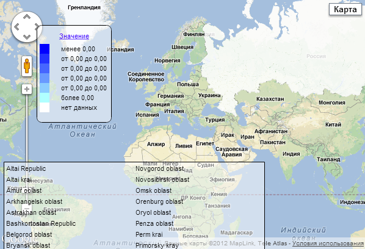

# EaxMapView.MapType

EaxMapView.MapType
-

**

# EaxMapView.MapType

## Синтаксис

MapType: [PP.MapChartType](dhtmlMapChart.chm::/Enums/MapChartType.htm)

## Описание

Свойство MapType** определяет
 тип карты экспресс-отчета.

## Комментарии

По умолчанию имеет значение [PP.MapChartType](dhtmlMapChart.chm::/Enums/MapChartType.htm).SVG.

Значение свойства можно установить с помощью метода setMapType,
 а возвратить - с помощью метода getMapType.

## Пример 1

Для выполнения примера необходимо наличие на html-странице компонента
 [ExpressBox](../../../Components/Express/ExpressBox/ExpressBox.htm)
 с наименованием «expressBox» (см. «[Пример
 создания компонента ExpressBox](../../../Components/Express/ExpressBox/ExpressBox_Example.htm)») и с загруженной картой в рабочей
 области. Установим тип карты экспресс-отчета [PP.MapChartType](dhtmlMapChart.chm::/Enums/MapChartType.htm).Google
 и обработаем события MapTypeChanged
 и GoogleLoadError:

// Получим представление карты экспресс-отчета
var eaxMapView = expressBox.getDataView().getMapView();
// Обработаем событие MapTypeChanged
eaxMapView.MapTypeChanged.add(function (sender, args) {
    console.log("Новый тип карты: " + args.Type);
});
// Обработаем событие GoogleLoadError
eaxMapView.GoogleLoadError.add(function (sender, args) {
    console.log("Ошибка загрузки карты Google.");
});
// Поменяем тип карты экспресс-отчета на карту Google
eaxMapView.setMapType(PP.MapChart.Type.Google);

В результате выполнения примера тип карты изменится на «Google», при
 этом сработает событие MapTypeChanged,
 которое выведет в консоль браузера новый тип:

Новый тип карты: Google

## Пример 2

Также пример использования данного свойство приведен на странице описания
 метода [EaxMapView.getSilverlightInstance](EaxMapView.getSilverlightInstance.htm).

См. также:

[EaxMapView](EaxMapView.htm)

		Справочная
		 система на версию 10.9
		 от 18/08/2025,
		 © ООО «ФОРСАЙТ»,
