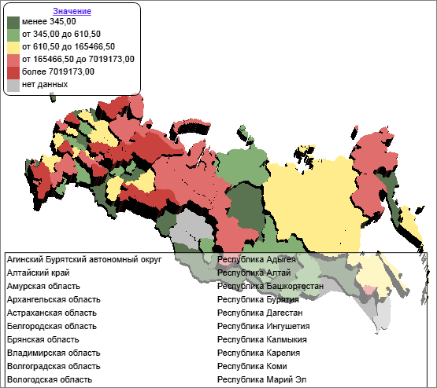
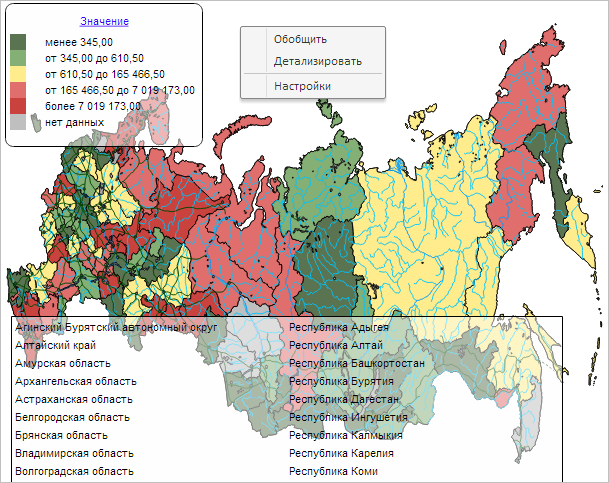

# EaxMapView.getSilverlightInstance

EaxMapView.getSilverlightInstance
-

**

# EaxMapView.getSilverlightInstance

## Синтаксис

getSilverlightInstance();

## Описание

Метод getSilverlightInstance**
 возвращает экземпляр Silverlight-объекта.

## Пример

Для выполнения примера необходимо наличие на html-странице компонента
 [ExpressBox](../../../Components/Express/ExpressBox/ExpressBox.htm)
 с наименованием «expressBox» (см. «[Пример
 создания компонента ExpressBox](../../../Components/Express/ExpressBox/ExpressBox_Example.htm)») и с загруженной картой в рабочей
 области. Загрузим в экспресс-отчета карту типа Silverlight3D:

// Получаем представление карты экспресс-отчета
var mapView = expressBox.getDataView().getMapView();
// Устанавливаем новый тип карты - Silverlight
mapView.setMapType(PP.MapChart.Type.Silverlight3D);
// Размещаем раскрывающиеся списки поверх карты
mapView.onDropDownStateChanged(true);

После того, как будет загружена карта нового типа, получим экземпляр
 Silverlight-объекта и определим его идентификатор:

if (mapView.isSLAvailable()) {
    // Получим экземпляр Silverlight-объекта
    console.log(mapView.getSilverlightInstance().id);
};
В результате выполнения примера в консоли браузера будет выведен
 идентификатор Silverlight-объекта:

Идентификатор Silverlight-объекта: 601f55b0-f316-4bb7-a4fd-529e4c2cdea1

При этом карта типа Silverlight3D будет выглядеть следующим образом:

В силу того, что был вызван метод [onDropDownStateChanged](EaxMapView.onDropDownStateChanged.htm)
 с параметром, равным значению true,
 при отображении раскрывающегося списка (в данном случае - контекстного
 меню) Silverlight-карта будет заменена на изображение SVG-карты:

См. также:

[EaxMapView](EaxMapView.htm)

		Справочная
		 система на версию 10.9
		 от 18/08/2025,
		 © ООО «ФОРСАЙТ»,
