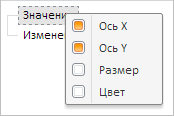
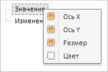
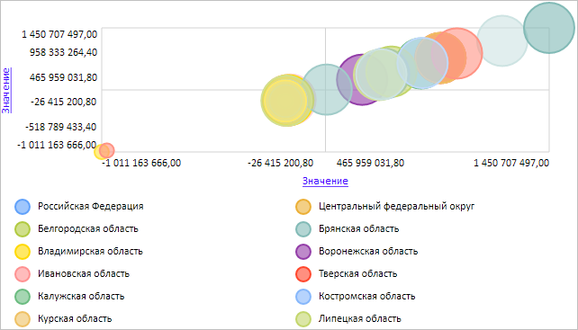

# EaxMdService.BubbleChart

EaxMdService.BubbleChart
-

**

# EaxMdService.BubbleChart

## Синтаксис

BubbleChart: Object

## Описание

Свойство BubbleChart** устанавливает и возвращает метаданные пузырьковой диаграммы экспресс-отчета.

## Комментарии

Значение свойства устанавливается с помощью метода setBubbleChart и возвращается с помощью метода getBubbleChart. Из JSON значение свойства задать нельзя.

Для вызова метода setBubbleChart указываются следующие аргументы: report - лист документа экспресс-отчета, metadata - JSON-объект со сведениями о пузырьковой диаграмме, callback - возвратная функция.

Для метода getBubbleChart указываются следующие параметры: analyzer - лист документа экспресс-отчета, callback - возвратная функция.

## Пример

Для выполнения примера необходимо наличие на html-странице компонента [ExpressBox](../../../Components/Express/ExpressBox/ExpressBox.htm) с наименованием «expressBox» (см. «[Пример создания компонента ExpressBox](../../../Components/Express/ExpressBox/ExpressBox_Example.htm)») и с загруженной пузырьковой диаграммой в рабочей области экспресс-отчета. Для показателя «Значение» данной пузырьковой диаграммы должны быть только включены измерения «Ось X» и «Ось Y»:

Включим индикатор «Размер» для показателя «Значение» данной пузырьковой диаграммы:

// Получим сервис для работы с экспресс-отчетом
var eaxMdService = expressBox.getService();
// Получим документ экспресс-отчета
var eaxDocument = expressBox.getSource();
// Определим метаданные для пузырьковой диаграммы экспресс-отчета
var metadata = {
    enabled: true,
    indicatorElements: {
        it: {
            Key: "Radial",
            Value: {
                key: "1",
                n: ""
            }
        }
    },
    visible: true
};
// Определим возвратную функцию
var onSetBubbleChart = function () {
    expressBox.getDataView().getBubbleChartView().PropertyChanged.fire(this, new PP.Mb.Ui.PropertyChangedEventArgs({
        PropertyName: "BubbleChart",
        Metadata: metadata,
        TypeUpdateData: [PP.Exp.Ui.ViewTypeUpdate.DataView, PP.Exp.Ui.ViewTypeUpdate.BubbleChart]
    }));
    // Обновляем экспресс-отчет
    expressBox.refreshAll();
}
// Установим метаданные для пузырьковой диаграммы экспресс-отчета
eaxMdService.setBubbleChart(eaxDocument, metadata, PP.Delegate(onSetBubbleChart, this));

В результате выполнения примера для показателя «Значение» пузырьковой диаграммы был установлен индикатор «Размер»:

Соответствующим образом изменится и пузырьковая диаграмма экспресс-отчета:

См. также:

[EaxMdService](EaxMdService.htm)

		Справочная
		 система на версию 10.9
		 от 18/08/2025,
		 © ООО «ФОРСАЙТ»,
