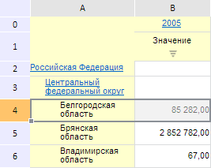
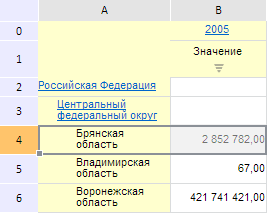

# EaxMdService.deleteFromDimSelection

EaxMdService.deleteFromDimSelection
-

**

# EaxMdService.deleteFromDimSelection

## Синтаксис

deleteFromDimSelection(report: PP.Exp.[EaxDocument](../EaxDocument/EaxDocument.htm),
 metadata: Object, callback: PP.Delegate);

## Параметры

*report.* Экспресс-отчет,
 для которого необходимо исключить элементы из отметки;

*metadata.* Метаданные, содержащие информацию об исключаемых элементах;

*callback.* Возвратная функция, которую
 необходимо вызвать для исключения элементов из отметки.

## Описание

Метод deleteFromDimSelection**
 удаляет элементы из отметки через координаты таблицы экспресс-отчета.

## Пример

Для выполнения примера необходимо наличие на html-странице компонента
 [ExpressBox](../../../Components/Express/ExpressBox/ExpressBox.htm)
 с наименованием «expressBox» (см. «[Пример
 создания компонента ExpressBox](../../../Components/Express/ExpressBox/ExpressBox_Example.htm)») и с загруженной таблицей, содержащей
 как минимум четыре строки:

Исключим элемент «Белгородская область» через координаты четвертой
 строки таблицы экспресс-отчета:

// Получим сервис для работы с экспресс-отчетом
var eaxMdService = expressBox.getService();
// Получим документ экспресс-отчета
var source = expressBox.getSource();
// Получим таблицу экспресс-отчета
var eaxGridForService = expressBox.getDataView().getGridView();
// Получим координаты выделенной области экспресс-отчета
var metadata = {
    deleteElements: {
        range: {
            height: 0,
            left: 0,
            parts: {
                it: {
                    height: 1,
                    left: 0,
                    top: 4,
                    type: "Cells",
                    width: eaxGridForService.getTabSheet().getMeasures().getMaxColumn()
                }
            },
            top: 0,
            type: "MultiPart",
            width: 0
        },
        type: "Normal"
    }
};
var metadataForService = new PP.Mb.Ui.PropertyChangedEventArgs({
    PropertyName: PP.Exp.Ui.ControlType.DimSelection,
    Metadata: metadata,
    TypeUpdateData: [PP.Exp.Ui.ViewTypeUpdate.DimBarSelection, PP.Exp.Ui.ViewTypeUpdate.DataView]
});
// Объявляем и инициализируем возвратную функцию, которую необходимо вызвать для удаления элементов из отметки
var onDeleteFromDimSelection = function (sender, args) {
    expressBox.getDataView().getMapView().MetadataChanged.fire(eaxGridForService, args.Args);
    expressBox.getDataView().refresh(args.Args)
};
// Удалим элемент из отметки через координаты таблицы экспресс-отчета
eaxMdService.deleteFromDimSelection(source, metadata, PP.Delegate(onDeleteFromDimSelection, eaxGridForService, metadataForService));

В результате выполнения примера был удален элемент «Белгородская область»
 через координаты четвертой строки таблицы экспресс-отчета:

См. также:

[EaxMdService](EaxMdService.htm)

		Справочная
		 система на версию 10.9
		 от 18/08/2025,
		 © ООО «ФОРСАЙТ»,
