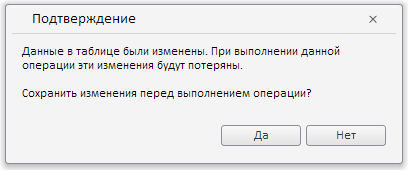
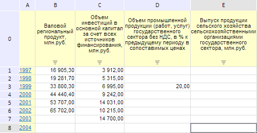

# EaxMdService.fetchData

EaxMdService.fetchData
-

**

# EaxMdService.fetchData

## Синтаксис

fetchData(report: PP.Exp.[EaxAnalyzer](../EaxAnalyzer/EaxAnalyzer.htm), callback: PP.Delegate, fromDimKey: Number);

## Параметры

*report.* Экспресс-отчёт, для которого необходимо выполнить обновление;

*callback.* Возвратная функция на получение метаданных отчета;

*fromDimKey.* Измерение, с которого идёт изменение отметки.

## Описание

Метод fetchData** обновляет данные в экспресс-отчёте из базы данных с отображением диалога подтверждения, если в таблице были изменены данные.

## Пример

Для выполнения примера необходимо наличие на html-странице компонента [ExpressBox](../../../Components/Express/ExpressBox/ExpressBox.htm) с наименованием «expressBox» (см. «[Пример создания компонента ExpressBox](../../../Components/Express/ExpressBox/ExpressBox_Example.htm)»), а также должна быть открыта таблица, у которой существует ячейка D3. Изменим значение этой ячейки и затем обновим все данные экспресс-отчёта c сохранением изменений:

// Получим сервис для работы с экспресс-отчетом
var eaxMdService = expressBox.getService();
// Получим документ экспресс-отчета
var eaxAnalyzer = expressBox.getSource();
// Получим таблицу экспресс-отчета
var gridView = expressBox.getDataView().getGridView();
// Установим значение для ячейки таблицы
gridView.setCellValue(20, 2, 2);
// Зададим координаты ячейки D3
var coord = new PP.Ui.TabSheetCoord({
    rowIndex: 3,
    colIndex: 3
});
// Объявим возвратную функцию
var callback = function () {
    gridView && gridView.getSource().getMetadata() && gridView.refreshAll();
};
// Обновим все данные в экспресс-отчёте с сохранением изменений
eaxMdService.fetchData(eaxAnalyzer, PP.Delegate(callback, expressBox));

В результате выполнения примера ячейке D3, имеющей координаты (3, 3) (отсчёт ведётся с нуля), было задано значение 20, затем после обновления экспресс-отчета был выведен диалог подтверждения сохранения измененных данных:

После нажатия на кнопку «Да» новое значение ячейки было сохранено:

См. также:

[EaxMdService](EaxMdService.htm)

		Справочная
		 система на версию 10.9
		 от 18/08/2025,
		 © ООО «ФОРСАЙТ»,
