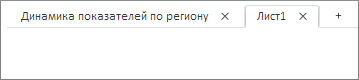
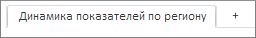

# EaxMdService.removeSheet

EaxMdService.removeSheet
-

**

# EaxMdService.removeSheet

## Синтаксис

removeSheet(document: PP.Exp.[EaxDocument](../EaxDocument/EaxDocument.htm), sheetKey, callback);

## Параметры

*document.* Документ исходного экспресс-отчета;

*sheetKey.* Ключ удаляемого листа экспресс-отчета;

*callback.* Возвратная функция.

## Описание

Метод removeSheet** удаляет указанный лист экспресс-отчета.

## Пример

Для выполнения примера необходимо наличие на html-странице компонента [ExpressBox](../../../Components/Express/ExpressBox/ExpressBox.htm) с наименованием «expressBox» (см. «[Пример создания компонента ExpressBox](../../../Components/Express/ExpressBox/ExpressBox_Example.htm)») с двумя листами, второй из которых является активным:

Удалим активный лист:

// Получим сервис для работы с экспресс-отчетом
var eaxMdService = expressBox.getService();
// Получим документ экспресс-отчета
var eaxDocument = expressBox.getSource();
// Получим ключ активного листа экспресс-отчета
var sheetKey = eaxDocument.getActiveSheetKey();
var sheetName = eaxDocument.getSheetName(sheetKey);
var onSrvSheetRemove = function (n, t) {
    var i = t.Args.IsLastTab ? t.Args.TabIndex - 1 : t.Args.TabIndex + 1;
    console.log("Наименование удаленного листа: " + sheetName);
    expressBox.getDataView().refresh();
};
eaxMdService.removeSheet(eaxDocument, sheetKey, PP.Delegate(onSrvSheetRemove, this, {
    RemoveSheetKey: sheetName,
    TabIndex: 2,
    IsLastTab: true
}));
// Обновим экспресс-отчет
expressBox.refreshAll();

В результате выполнения примера второй активный лист был удалён, его наименование было выведено в консоли браузера:

Наименование удаленного листа: Лист1

При этом активным станет первый лист документа экспресс-отчета:

См. также:

[EaxMdService](EaxMdService.htm)

		Справочная
		 система на версию 10.9
		 от 18/08/2025,
		 © ООО «ФОРСАЙТ»,
