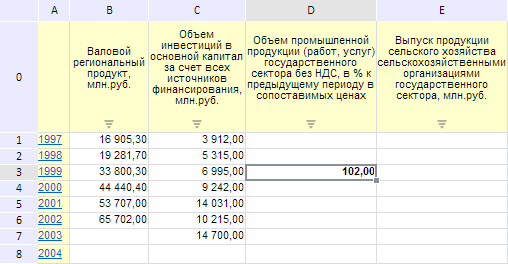
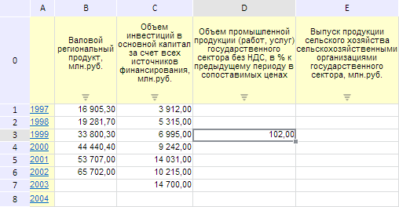

# EaxMdService.saveTableData

EaxMdService.saveTableData
-

**

# EaxMdService.saveTableData

## Синтаксис

saveTableData(report, metadata, saveData, callback);

## Параметры

*report.* Экспресс-отчет, для которого необходимо сохранить данные;

*metadata.* Метаданные;

*saveData.* Признак того, что необходимо сохранить данные экспресс-отчета ;

*callback.* Возвратная функция.

## Описание

Метод saveTableData** сохраняет данные таблицы в экспресс-отчете.

## Пример

Для выполнения примера необходимо наличие на html-странице компонента [ExpressBox](../../../Components/Express/ExpressBox/ExpressBox.htm) с наименованием «expressBox» (см. «[Пример создания компонента ExpressBox](../../../Components/Express/ExpressBox/ExpressBox_Example.htm)») и с загруженной таблицей в рабочей области экспресс-отчёта. Добавим в произвольную ячейку данной таблицы значение 102 (при этом несохраненное значение будет отмечено полужирным шрифтом):

Далее сохраним внесенные изменения:

// Получим сервис для работы с экспресс-отчетом
var eaxMdService = expressBox.getService();
// Получим документ экспресс-отчета
var eaxAnalyzer = expressBox.getSource();
// Сохраняем данные таблицы экспресс-отчета
eaxMdService.saveTableData(eaxAnalyzer, null, !0);

В результате выполнения примера введенное значение будет сохранено:

См. также:

[EaxMdService](EaxMdService.htm)

		Справочная
		 система на версию 10.9
		 от 18/08/2025,
		 © ООО «ФОРСАЙТ»,
