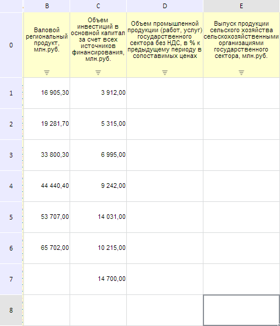
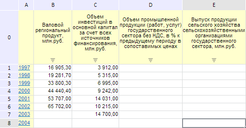

# EaxMdService.setCellsAutoFit

EaxMdService.setCellsAutoFit
-

**

# EaxMdService.setCellsAutoFit

## Синтаксис

setCellsAutoFit(report: PP.Exp.[EaxAnalyzer](../EaxAnalyzer/EaxAnalyzer.htm), metadata: EaxGridAdjust, sizeMd, callback);

## Параметры

*report.* Экспресс-отчёт, для которого применяется метод;

*metadata.* Объект с настройками автоподгонки ячеек;

*sizeMd.* Объект с размерами листа документа.

*callback.* Возвратная функция.

## Описание

Метод setCellsAutoFit** устанавливает автоподгонку для ячеек таблицы экспресс-отчета.

## Пример

Для выполнения примера необходимо наличие на html-странице компонента [ExpressBox](../../../Components/Express/ExpressBox/ExpressBox.htm) с наименованием «expressBox» (см. «[Пример создания компонента ExpressBox](../../../Components/Express/ExpressBox/ExpressBox_Example.htm)») и с загруженной таблицей в рабочей области экспресс-отчёта. При этом данная таблица может выглядеть следующим образом:

Установим стиль автоподгонки для ячеек таблицы экспресс-отчета:

// Получим сервис для работы с экспресс-отчетом
var eaxMdService = expressBox.getService();
// Получим документ экспресс-отчета
var eaxAnalyzer = expressBox.getSource();
// Инициализируем возвратную функцию
var onOpenAutoFitSet = function () {
    expressBox.getDataView().refreshAll();
    expressBox.getDataView().setIsVisible(PP.Ui.Visibility.Visible)
};
// Определяем размер листа документа
var sizeMd = PP.getProperty(eaxAnalyzer.getMetadata(), "grid.adjust");
// Определяем настройки автоподгонки ячеек
var state = expressBox.getDataView().getGridView().getTabSheetViewState();
eaxMdService.setCellsAutoFit(eaxAnalyzer, state, sizeMd, PP.Delegate(onOpenAutoFitSet, eaxMdService));
// Обновим экспресс-отчет
expressBox.refreshAll();

В результате выполнения примера таблица экспресс-отчета после автоподгонки ячеек будет выглядеть следующим образом:

См. также:

[EaxMdService](EaxMdService.htm)

		Справочная
		 система на версию 10.9
		 от 18/08/2025,
		 © ООО «ФОРСАЙТ»,
