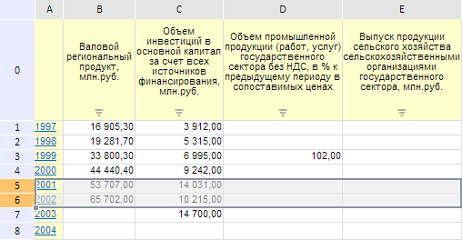
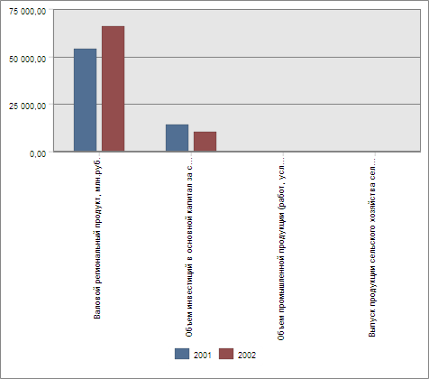

# EaxMdService.setChartDataSource

EaxMdService.setChartDataSource
-

**

# EaxMdService.setChartDataSource

## Синтаксис

setChartDataSource(report: PP.Exp.[EaxAnalyzer](../EaxAnalyzer/EaxAnalyzer.htm),
 metadata: EaxInteractiveMode, callback);

## Параметры

*report.* Экспресс-отчёт,
 для диаграммы которого необходимо установить источник данных;

*metadata.* Объект с настройками;

*callback.* Возвратная
 функция.

## Описание

Метод setChartDataSource**
 устанавливает источник данных для диаграммы экспресс-отчета.

## Пример

Для выполнения примера необходимо наличие на html-странице компонента
 [ExpressBox](../../../Components/Express/ExpressBox/ExpressBox.htm)
 с наименованием «expressBox» (см. «[Пример
 создания компонента ExpressBox](../../../Components/Express/ExpressBox/ExpressBox_Example.htm)») и с загруженной диаграммой в
 рабочей области экспресс-отчёта. Установим источник данных для этой диаграммы,
 который будет зависеть от выделения в таблице:

// Получим сервис для работы с экспресс-отчетом
var eaxMdService = expressBox.getService();
// Получим документ экспресс-отчета
var eaxAnalyzer = expressBox.getSource();
// Определяем метаданные
var metadata = expressBox.getRibbonView().getChartCategory().getChartDataSourceState();
// Использовать выделение таблицы
metadata.useGridSelection = true;
// Определяем аргументы для возвратной функции
var args = new PP.Mb.Ui.PropertyChangedEventArgs({
    PropertyName: PP.Exp.Ui.ControlType.DataSources,
    Metadata: metadata,
    TypeUpdateData: [PP.Exp.Ui.ViewTypeUpdate.Chart]
});
// Определяем возвратную функцию
var onPanelChanged = function (n, t) {
    var chartView = expressBox.getDataView().getChartView();
    t.Args ? (chartView.DataChanged.fire(chartView, t.Args), t.Args.fireCallback(n, t)) : chartView.DataChanged.fire(chartView, t);
    t.Args && t.Args.getPropertyName() == PP.Exp.Ui.ControlType.DataSources && chartView.refreshAll();
    console.log("Источник данных для диаграммы экспресс-отчета устновлен.");
};
// Устанавливаем источник данных для диаграммы экспресс-отчета
eaxMdService.setChartDataSource(eaxAnalyzer, metadata, PP.Delegate(onPanelChanged, eaxMdService, args));

В результате выполнения примера был установлен источник данных для диаграммы
 экспресс-отчета, зависящий от выделения в таблице, о чем в консоли браузера
 было выведено соответствующее сообщение.

Так выберем в таблице экспресс-отчета строки, соответствующие 2001 и
 2002 году:

Благодаря выполненному примеру на диаграмме экспресс-отчета будут выведены
 данные только за указанные годы - 2001 и 2002:

См. также:

[EaxMdService](EaxMdService.htm)

		Справочная
		 система на версию 10.9
		 от 18/08/2025,
		 © ООО «ФОРСАЙТ»,
