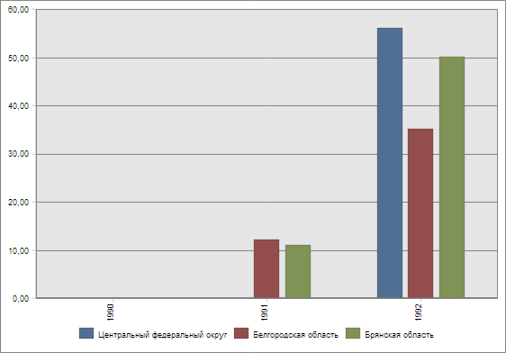
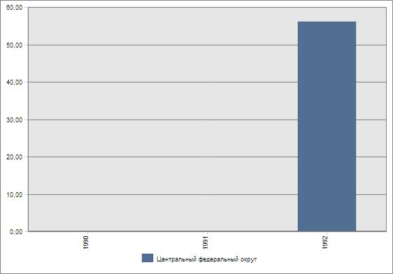

# EaxMdService.setChartSelectionAction

EaxMdService.setChartSelectionAction
-

**

# EaxMdService.setChartSelectionAction

## Синтаксис

setChartSelectionAction(report: PP.Exp.[EaxDocument](../EaxDocument/EaxDocument.htm), metadata: Object, callback: PP.Delegate);

## Параметры

*report.* Документ экспресс-отчета;

*metadata.* Метаданные, содержащие информацию о выбранных рядах диаграммы (свойство Method) и действии, которое нужно над ними выполнить (свойство Selection);

*callback.* Возвратная функция.

## Описание

Метод setChartSelectionAction** определяет действие над выделенными рядами диаграммы экспресс-отчета.

## Пример

Для выполнения примера необходимо наличие на html-странице компонента [ExpressBox](../../../Components/Express/ExpressBox/ExpressBox.htm) с наименованием «expressBox» (см. «[Пример создания компонента ExpressBox](../../../Components/Express/ExpressBox/ExpressBox_Example.htm)») и с загруженной диаграммой в рабочей области экспресс-отчёта. До выполнения примера диаграмма экспресс-отчета выглядела следующими образом:

Исключим из диаграммы второй и третий ряд:

// Получим сервис для работы с экспресс-отчетом
var eaxMdService = expressBox.getService();
// Получим документ экспресс-отчета
var eaxAnalyzer = expressBox.getSource();
// Определим ряды диаграммы и действие, которое нужно над ними выполнить
var metadata = {
    Method: "Exclude", // Операция исключения рядов
    Selection: { // Выберем ряды для исключения
        series: {
            Item: [{
                index: 1, // Второй ряд
                points: {
                    Item: [1]
                }
            }, {
                index: 2, // Третий ряд
                points: {
                    Item: [1]
                }
            }]
        }
    }
};
// Определим возвратную функцию
var onSetSelectionAction = function () {
    var chartView = expressBox.getDataView().getChartView();
    var mapView = expressBox.getDataView().getMapView();
    mapView.MetadataChanged.fire(chartView, new PP.Mb.Ui.PropertyChangedEventArgs({
        TypeUpdateData: [PP.Exp.Ui.ViewTypeUpdate.Table]
    }));
    // Обновим диаграмму
    chartView.refreshAll();
};
// Исключим из диаграммы второй и третий ряды
eaxMdService.setChartSelectionAction(eaxAnalyzer, metadata, PP.Delegate(onSetSelectionAction, this));

В результате выполнения примера из диаграммы экспресс-отчёта были исключены второй и третий ряд:

См. также:

[EaxMdService](EaxMdService.htm)

		Справочная
		 система на версию 10.9
		 от 18/08/2025,
		 © ООО «ФОРСАЙТ»,
