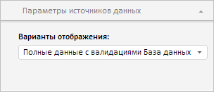

# EaxMdService.setDataSourceDestination

EaxMdService.setDataSourceDestination
-

**

# EaxMdService.setDataSourceDestination

## Синтаксис

setDataSourceDestination(analyzer: PP.Exp.[EaxAnalyzer](../EaxAnalyzer/EaxAnalyzer.htm), destinationData: Object, callback: PP.Delegate);

## Параметры

*analyzer.* Экземпляр экспресс-отчета;

*destinationData.* JSON-объект с метаданными отображения, доступного для источника;

*callback.* Обработчик завершения установки варианта отображения.

## Описание

Метод setDataSourceDestination** устанавливает вариант отображения источника данных.

## Пример

Для выполнения примера необходимо наличие на html-странице компонента [ExpressBox](../../../Components/Express/ExpressBox/ExpressBox.htm) с наименованием «expressBox» (см. «[Пример создания компонента ExpressBox](../../../Components/Express/ExpressBox/ExpressBox_Example.htm)»). В [настройках параметров источника данных](../DataSourceParamsPanel/DataSourceParamsPanel.htm) должна быть доступна возможность выбора вариантов отображения источника:

Установим вариант отображения «Полные данные с валидациями»:

// Получим сервис для работы с экспресс-отчетом
var eaxMdService = expressBox.getService();
// Получим документ экспресс-отчета
var eaxAnalyzer = expressBox.getSource();
// Получим панель параметров источника данных
var dataSourceParamsPanel = expressBox.getPropertyBarView().getDataSourceParamsPanel();
// Развернём и покажем вкладку "Параметры источников данных"
dataSourceParamsPanel.setDestsSectionVisible(true);
dataSourceParamsPanel.expand();
dataSourceParamsPanel.show();
// Определим метаданные
var destinationData = {
    CubeKey: 4,
    CubeId: "FULL",
    DestMeta: {
        id: "FULL_VALIDATION",
        isDefault: false,
        k: 5,
        n: "Полные данные с валидациями База данных временных рядов",
        vis: true
    }
};
// Определим аргументы возвратной функции
var cubeDestArgs = new PP.Mb.Ui.PropertyChangedEventArgs({
    PropertyName: PP.Exp.Ui.ControlType.CubeDest,
    Metadata: destinationData,
    TypeUpdateData: [PP.Exp.Ui.ViewTypeUpdate.DataView, PP.Exp.Ui.ViewTypeUpdate.Ribbon, PP.Exp.Ui.ViewTypeUpdate.PropertyBar]
});
// Определим возвратную функцию
var onSetDataSourceDestination = function (sender, args) {
    expressBox.getDataView().DocDataChanged.fire(this, args);
    expressBox.getPropertyBarView().refreshAll();
}
// Установим новый вариант отображения источника данных
eaxMdService.setDataSourceDestination(eaxAnalyzer, destinationData, PP.Delegate(onSetDataSourceDestination, this, cubeDestArgs));

В результате выполнения примера будет установлен вариант отображения источника данных «Полные данные с валидациями»:

См. также:

[EaxMdService](EaxMdService.htm)

		Справочная
		 система на версию 10.9
		 от 18/08/2025,
		 © ООО «ФОРСАЙТ»,
