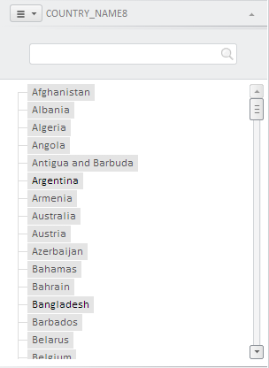
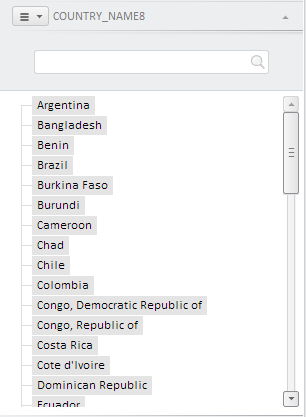

# EaxMdService.setDimDataFilter

EaxMdService.setDimDataFilter
-

**

# EaxMdService.setDimDataFilter

## Синтаксис

setDimDataFilter(report: PP.Exp.[EaxAnalyzer](../EaxAnalyzer/EaxAnalyzer.htm),
 dFilter: Object, callback: PP.Delegate);

## Параметры

*report.* Экспресс-отчет, для элементов
 подсветки которого нужно установить фильтр;

*dFilter.* Настройки фильтра: JSON-объект
 со свойствами min (минимальное значение) и max (максимальное значение)
 Если настройки не указаны, то элементы подсвечиваются в соответствии с
 данными, установленными в числовых редакторах «Подсветить между значениями»
 на вкладке панели свойств «Данные».

*callback.* Возвратная
 функция.

## Описание

Метод setDimDataFilter**
 устанавливает фильтр для элементов подсветки экспресс-отчёта.

## Пример

Для выполнения примера предполагается наличие на странице компонента
 [ExpressBox](../../../Components/Express/ExpressBox/ExpressBox.htm)
 с наименованием «expressBox» и сервиса для работы с экспресс-отчетами
 с наименованием «eaxMdService» (см. «[Пример
 создания компонента ExpressBox](../../../Components/Express/ExpressBox/ExpressBox_Example.htm)»). Установим фильтр для элементов подсветки
 экспресс-отчета:

eaxMdService.setDimDataFilter(expressBox.getSource().getActiveSheet(), {
   min: 1,
   max: 10
}, function (sender, args) {
   console.log("Элементы измерения подсвечены")
});
После выполнения примера на вкладке панели свойств «Отметка» будут подсвечены
 элементы измерения, содержащие значения от 1 до 10:

В консоль браузера будет выведено сообщение «Элементы измерения подсвечены».

Далее скроем все неподсвеченные элементы на открытой панели:

propBar = expressBox.getPropertyBarView();
propBar.getDimBarMasterView();
dimBarM = propBar.getDimBarMasterView();
dimBarMP = dimBarM.getActivePanel();
dtv = dimBarMP.getDimTreeView();
dtv.setHideShadedEls(true);
Все неподсвеченные элементы на открытой панели будут скрыты:

См. также:

[EaxMdService](EaxMdService.htm)

		Справочная
		 система на версию 10.9
		 от 18/08/2025,
		 © ООО «ФОРСАЙТ»,
