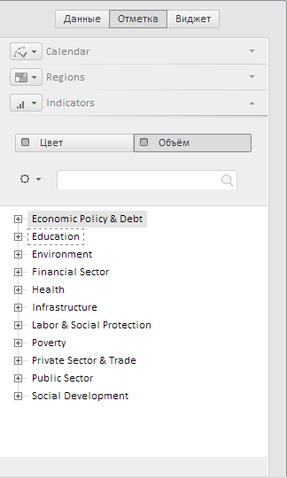

# EaxMdService.setEnabled3D

EaxMdService.setEnabled3D
-

# EaxMdService.setEnabled3D

## Синтаксис

setEnabled3D (report: PP.Exp.[EaxDocument](../EaxDocument/EaxDocument.htm), value: Boolean, callback);

## Параметры

report. Отчет, для которого будет включена/отключена возможность отображения 3D-карт;

value. Параметр, определяющий, будут ли доступны в отчете 3D-карты: true - будут доступны, false - не будут;

callback. Процедура обратного вызова.

## Описание

Метод setEnabled3D устанавливает возможность отображать 3D-карт в экспресс-отчете.

## Комментарии

Возможность отображения карт в режиме 3D включается/отключается при нажатии на кнопку «3D» на вкладке ленты «Карта». Если возможность отображения карт в режиме 3D включена, на вкладке панели свойств «Отметка», на панели измерения метрик появятся вкладки «Цвет» и «Объем»:

## Пример

Для выполнения примера необходимо наличие на html-странице компонента [ExpressBox](../../../Components/Express/ExpressBox/ExpressBox.htm) с наименованием «expressBox» (см. «[Пример создания компонента ExpressBox](../../../Components/Express/ExpressBox/ExpressBox_Example.htm)»). Включим возможность отображения карт в режиме 3D:

//получаем источник отчета
source = expressBox.getSource()
//получаем сервис для работы с экспресс-отчетами
service = expressBox._Service;
//включаем возможность отображения 3D-карт
service.setEnabled3D(source, false);

После выполнения примера для экспресс-отчета будет включена возможность отображения 3D-карт. На панели измерения метрик появятся вкладки «Цвет» и «Объем», при помощи которых будут выбираться данные для цветового и объемного индикаторов (см. рисунок в разделе «Комментарии»).

См. также:

[EaxMdService](EaxMdService.htm)

		Справочная
		 система на версию 10.9
		 от 18/08/2025,
		 © ООО «ФОРСАЙТ»,
